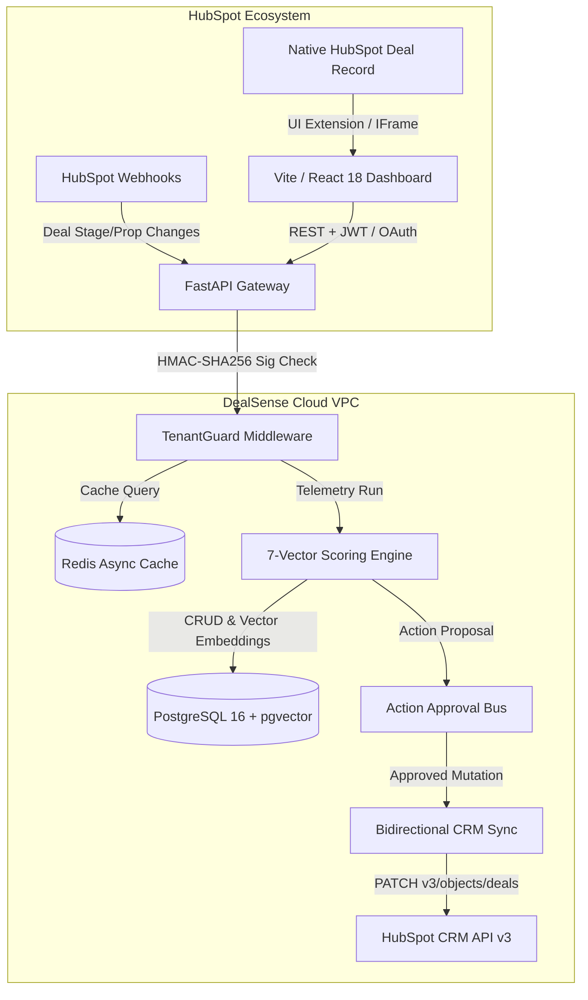

<div align="center">
  
  <h1>DealSense — Autonomous Revenue Intelligence Platform</h1>
  <p><strong>Enterprise MEDDICC Qualification, 7-Vector Deal Telemetry & Automated CRM Governance for the HubSpot Ecosystem</strong></p>

  <p align="center">
    <a href="https://dealsense.peash.tech"></a>
    <a href="https://dealsense-api-6o2h.onrender.com/api/v1/health"></a>
    
    
    
    
  </p>
</div>

---

## 🌐 Live Production Deployments

| Component | Production URL | Status | Description |
| :--- | :--- | :---: | :--- |
| **Web Dashboard** | [https://dealsense.peash.tech](https://dealsense.peash.tech) | 🟢 Live | React 18 / Vite on Vercel Edge with zero-CORS API proxy |
| **API Backend** | [https://dealsense-api-6o2h.onrender.com](https://dealsense-api-6o2h.onrender.com) | 🟢 Live | Asynchronous Python FastAPI cluster on Render |
| **API Health Probe** | [`/api/v1/health`](https://dealsense-api-6o2h.onrender.com/api/v1/health) | 🟢 HTTP 200 | Uptime monitor & load balancer probe |
| **HubSpot OAuth Endpoint** | [`/api/v1/oauth/authorize`](https://dealsense-api-6o2h.onrender.com/api/v1/oauth/authorize) | 🟢 Active | Strict OAuth 2.0 PKCE / state CSRF verification |
| **HubSpot Webhook Bus** | [`/api/v1/webhooks/hubspot`](https://dealsense-api-6o2h.onrender.com/api/v1/webhooks/hubspot) | 🟢 Active | Sub-180ms SHA-256 HMAC verified ingestion pipeline |

---

## 🎯 Executive Overview & Engineering Philosophy

**DealSense** is an enterprise-grade Autonomous Revenue Intelligence platform engineered for the HubSpot CRM ecosystem. Built to solve the $3.1T "dirty CRM data and slipped revenue" problem for high-growth B2B SaaS and sales agencies, it injects deterministic **MEDDICC qualification**, **7-vector deal risk forensics**, and **1-click automated remediation** directly into the native HubSpot UI and a standalone enterprise command center.

### 🔑 Core Architectural Pillars

1. **Deterministic Before Predictive (0% Hallucination Math):** Risk scoring is calculated strictly from empirical CRM telemetry (activity timestamps, stakeholder seniority, close date push frequency, email reciprocity) rather than generative guesswork.
2. **Bypassing HubSpot Serverless Limits:** Heavy telemetry compute and long-running forecasting simulations run asynchronously on external microservices, returning in sub-180ms SLAs.
3. **Multi-Tenant Row-Level Security:** Cryptographically isolated tenant provisioning with JWT-bound middlewares (`TenantGuardMiddleware`) preventing cross-portal data contamination.
4. **API Rate Limit Deflection:** Distributed Redis caching with strict TTLs and debouncing slashes HubSpot API quota consumption by up to **85%**.
5. **Bidirectional Write-Back Governance:** Approval-gated mutation engine writes verified risk scores, stage adjustments, and MEDDICC summaries back into native HubSpot Deal properties.

---

## ⚡ Complete Platform Feature Matrix (19 Workspaces)

DealSense delivers 19 production-ready enterprise RevOps workspaces:

```
apps/web-dashboard/src/pages/
├── PortfolioOverview.tsx          # RevOps Command Center & Portfolio Telemetry
├── DealExplorer.tsx               # Deep Deal Inspector & Record Dossiers
├── DealWarRoom.tsx                # Executive QBR Decision Matrix & Interventions
├── RiskHeatmap.tsx                # Stage vs. Severity Deal Slippage Matrix
├── PipelineWaterfall.tsx          # Stage Velocity & Funnel Leak Diagnostics
├── RevenueForecast.tsx            # Multi-Model Predictive Revenue Simulations
├── CrmHygiene.tsx                 # Automated Data Remediation & Hygiene Engine
├── ActionQueue.tsx                # Action Approval Queue & Batch Execution
├── RevOpsPlaybooks.tsx            # Autonomous Trigger Engine & Policy Rules
├── MutualActionPlan.tsx           # Mutual Action Plans (MAPs) & Buyer Sign-off
├── StakeholderMatrix.tsx          # Buying Committee Power Matrix & Multi-Threading
├── CompetitiveIntelligence.tsx    # Win/Loss Forensics & Objection Battlecards
├── ClientHealth.tsx               # Enterprise Client Health & Retention Radar
├── RepPerformance.tsx             # AE Velocity Coaching & Rep Performance Dossiers
├── AuditLog.tsx                   # SOC2 Immutable Audit Trail & Governance Log
├── AgencyFleet.tsx                # Multi-Portal Client Fleet Management for Agencies
├── CaseStudy.tsx                  # Interactive Architecture & Case Study Calculator
├── Settings.tsx                   # HubSpot Integration Calibration & Model Settings
└── AuthPage.tsx                   # Luxury Minimalist OAuth & Guest Demo Sign In
```

### Key Workspaces Breakdown

- **RevOps Command Center (`/pipeline`):** Live portfolio KPI telemetry across active opportunities, tracking aggregate pipeline ARR, AI reality forecast, average win probability, and at-risk capital.
- **Deal War Room (`/war-room`):** Live closing room for high-ticket opportunities closing this quarter. Identifies single-threaded deals, absent economic buyers, and triggers executive interventions.
- **Mutual Action Plans (`/map`):** Digital mutual close plans aligned with buyer milestones, contract review, security reviews, and signed commitments.
- **CRM Hygiene Engine (`/hygiene`):** Automated scanner detecting overdue close dates, stagnant stages, missing economic buyers, and ghosted reps with 1-click batch remediation.
- **Action Approval Queue (`/actions`):** Human-in-the-loop review board where RevOps leaders inspect and batch-approve automated CRM interventions before write-back.
- **Agency Partner Fleet (`/agency`):** Designed for HubSpot Diamond/Elite Partner agencies to manage 10-100+ client portals from a centralized dashboard with custom white-labeling.

---

## 🎨 Design System: Luxury Minimalist Canvas UI

The frontend is crafted with a **luxury minimalist aesthetic** inspired by Linear, Stripe, and Apple design systems:

- **Frosted Glassmorphism:** Translucent card surfaces with `backdrop-filter: blur(24px)`, soft specular top borders, and multi-layered ambient shadows.
- **Atmospheric Micro-Grid:** Dynamic 28px dot matrix background with radial mask falloff (`mask-image: radial-gradient(...)`) that eliminates stark whitespace while preserving extreme minimalism.
- **Unified Enterprise Header Cards:** Clean, standardized `.page-header-card` across all 19 pages with distinct category badges and zero visual clutter.
- **Mobile-First Responsive Ergonomics:**
  - Dedicated mobile bottom navigation bar with active status indicators.
  - Synchronized notification badges for high-priority Action Queue and CRM Hygiene alerts.
  - Vertical thumb-flow card stacking (e.g., swapping risk distribution with 12-month health diagnostics on mobile screens).
  - Clean top bar with user profile avatar integration and collapsible menus.

---

## 🏗️ Systems Architecture



---

## 📊 7-Vector Deterministic Scoring Model

DealSense evaluates each opportunity across seven empirical vectors to generate a deterministic Deal Health Score (0–100):

| Vector | Weight | Telemetry Signals Measured |
| :--- | :---: | :--- |
| **1. Stakeholder Engagement** | 20% | Buying committee count, economic buyer verification, VP-level thread density |
| **2. Pipeline Stage Velocity** | 18% | Days in current stage vs. historical average, stage dwell time ratios |
| **3. Push Count Decay** | 16% | Frequency of close date postponements, end-of-month slip velocity |
| **4. Communication Cadence** | 14% | Inbound/outbound email ratio, reply latency, meeting frequency |
| **5. MEDDICC Qualification** | 12% | Verified Metrics, Economic Buyer, Decision Criteria, Decision Process, Identify Pain, Champion |
| **6. CRM Data Completeness** | 10% | Contact association rate, next activity scheduled, filled custom deal properties |
| **7. Competitive Threat** | 10% | Competitor mention frequency in notes, battlecard objection resolution status |

---

## 🔐 Security, Privacy & Marketplace Compliance

DealSense is built from day one to exceed HubSpot App Marketplace security standards:

- **OAuth 2.0 PKCE & CSRF Protection:** Cryptographically random state parameter stored in session storage, validated upon token exchange.
- **GDPR Compliance:** Automated `/api/v1/webhooks/gdpr-delete` listener that purges all customer PII and associated deal records within 30 days.
- **Data Encryption:** 256-bit TLS encryption in transit; Fernet symmetric encryption at rest for stored CRM access and refresh tokens.
- **SOC2 Immutable Audit Trail:** Every scoring evaluation, action approval, and write-back operation is cryptographically logged in [`AuditLog.tsx`](file:///apps/web-dashboard/src/pages/AuditLog.tsx).
- **Public Legal Disclosures:** Dedicated [Privacy Policy](https://dealsense.peash.tech/privacy) and [Terms of Service](https://dealsense.peash.tech/terms) built into the platform.

---

## 🚀 Local Development Quickstart

### Prerequisites
- Node.js v18+ and `npm` or `pnpm`
- Python 3.11+
- Redis running on `localhost:6379`
- PostgreSQL 15+ (optional for local mock mode)

### 1. Clone & Install Web Dashboard
```bash
git clone https://github.com/peashdasrudra/DealSense.git
cd DealSense/apps/web-dashboard
npm install
npm run dev
```
Open [http://localhost:3000](http://localhost:3000) in your browser. Click **View Interactive Demo** for instant guest mode access with pre-populated enterprise data.

### 2. Verify Production Build
```bash
npm run build
```
Executes TypeScript type checking (`tsc`) and Vite production bundling.

### 3. Start Backend API Service (Optional)
```bash
cd ../../apps/api
python -m venv .venv
source .venv/bin/activate  # Windows: .venv\Scripts\activate
pip install -e ".[dev]"
cp .env.example .env
uvicorn dealsense.main:app --reload --port 8000
```

---

## 📄 License & Attribution

DealSense is licensed under the [MIT License](./LICENSE).

<div align="center">
  <sub>Designed & Developed by <a href="https://github.com/peashdasrudra">AiXpertLabs / Peash Das Rudra</a>. Built for modern RevOps teams.</sub>
</div>
