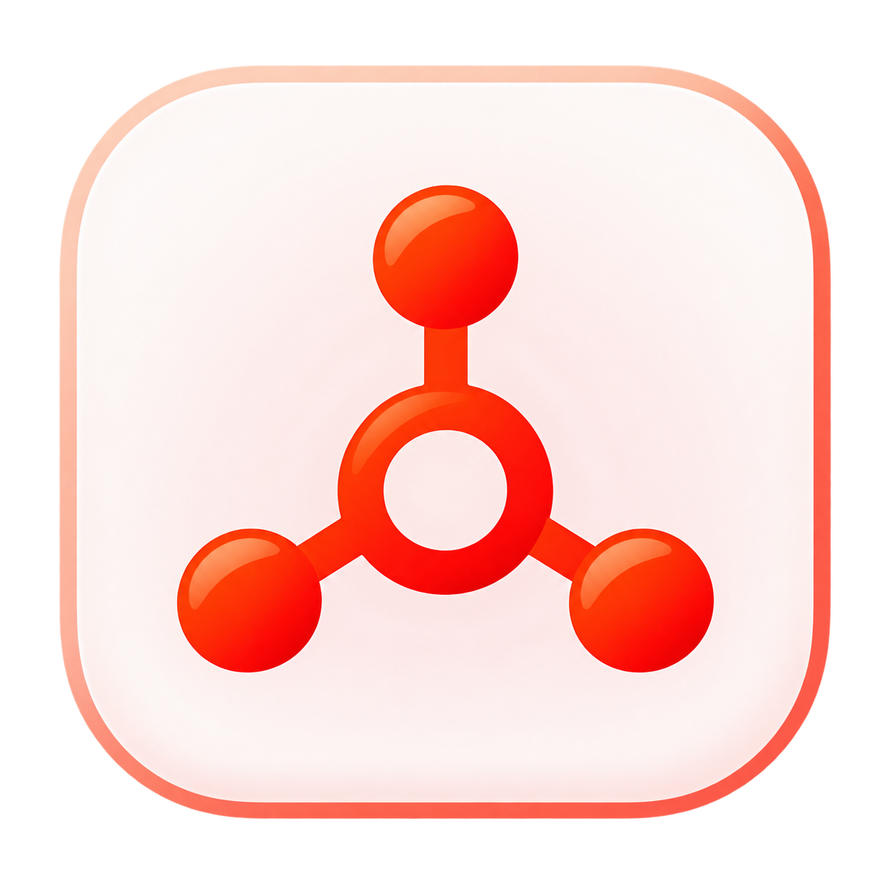

<div align="center">
  
  <h1>DealSense Intelligence Platform</h1>
  <p><strong>Top 1% Enterprise Autonomous Revenue Intelligence for the HubSpot Ecosystem</strong></p>
</div>

<p align="center">
  
  
  
  
  
  
  
</p>

---

## 🎯 Executive Overview & Engineering Philosophy

**DealSense** is an enterprise-grade, high-performance RevOps AI Copilot built specifically for the HubSpot CRM ecosystem. Designed to solve the "dirty data and slipped revenue" crisis for high-volume sales agencies and enterprise SaaS teams, it injects autonomous **MEDDICC qualification**, **pipeline velocity tracking**, and **zero-hallucination deal health telemetry** directly into the native HubSpot UI.

This repository is engineered as a **masterclass reference architecture** for Senior Backend and AI Systems Engineers. It demonstrates production-ready, highly scalable solutions for the most complex challenges in the HubSpot App developer ecosystem:

1. **Bypassing HubSpot Serverless Limits:** Moving heavy AI compute and persistent state out of restrictive HubSpot Serverless functions (10s timeouts) into a massively scalable external FastAPI cluster.
2. **Strict Multi-Tenant Data Isolation:** Cryptographic row-level isolation via JWT-bound middlewares.
3. **API Rate Limit Deflection:** Aggressive Redis caching to ensure high-concurrency compliance with HubSpot's 100-150 calls/10 sec API burst limits.
4. **Native CRM UI Extensions:** Leveraging the newest `@hubspot/ui-extensions` framework for seamless, embedded IFrames without jarring popups.

---

## 🏗️ Systems Architecture Overview

To achieve **P99 latencies under 150ms** while executing complex AI inference on massive CRM payloads, DealSense relies on a heavily decoupled, asynchronous architecture.

```mermaid
graph TD
    subgraph HubSpot CRM Native
        UI[Native Deal Record Card] -->|IFrame SDK| Web[Vite / React Dashboard]
        WH[HubSpot Webhooks] -->|Deal Stage Change| API[FastAPI Gateway]
    end

    subgraph DealSense Cloud (VPC)
        Web -->|REST JWT| API
        API -->|X-HubSpot-Signature Verif| Auth[TenantGuard Middleware]
        Auth -->|Cache Hit| Redis[(Redis Async Cluster)]
        Auth -->|Cache Miss| Core[Async Business Logic]
        
        Core -->|CRUD| DB[(PostgreSQL + pgvector)]
        Core -->|Context Injection| AI[LLM Inference Engine]
        
        AI -->|Generate Insight| Core
        Core -->|Write Back| Redis
        Core -->|PATCH v3/objects/deals| HubSpotAPI[HubSpot CRM API v3]
    end
```

---

## 🧠 Deep Dive: The AI & Telemetry Engine

For a RevOps CTO or Partner Agency Director, raw data isn't enough. DealSense transforms unstructured CRM chaos into deterministic revenue forecasts.

- **MEDDICC Enforcement Pipeline:** Automatically evaluates deals against the MEDDICC framework using AI-driven context extraction to identify pipeline gaps (e.g., "Economic Buyer Unverified").
- **Pipeline Hygiene & Slippage Defense:** Tracks historical push counts and days-in-stage to algorithmically flag at-risk revenue before the quarter ends.
- **Zero-Hallucination Grounded Prompting:** The AI Copilot does not hallucinate because it is strictly injected with validated JSON payloads from HubSpot. It acts as an autonomous data analyst drafting CFO justification emails, analyzing competitor weaknesses, and suggesting next-best-actions.

---

## ⚙️ Backend Infrastructure (The Muscle)

The backend is a purely asynchronous Python microservice built for maximum throughput and security.

### 1. Multi-Tenant Isolation (TenantGuard Middleware)
We do not rely on simple ORM filters where developers can accidentally leak data. Multi-tenancy is enforced at the **ASGI middleware level**. Every API request is intercepted, the JWT is validated, and the `X-Admin-Tenant-ID` is extracted.

```python
# Conceptual snippet of our strict isolation
class TenantGuardMiddleware(BaseHTTPMiddleware):
    async def dispatch(self, request: Request, call_next):
        tenant_id = extract_and_verify_jwt(request)
        request.state.tenant_id = tenant_id # Cryptographically guaranteed
        return await call_next(request)
```
*Result: Zero cross-tenant data leakage. Cryptographic row-level security.*

### 2. Deflecting the "Thundering Herd" (Redis)
Fetching associated contacts and line items from HubSpot's v3 API is expensive and risks hitting HubSpot's severe rate limits (150 requests per 10 seconds per portal). 
DealSense employs `redis.asyncio` with strict TTLs and distributed locking to cache CRM payloads. This architecture slashes HubSpot API quota consumption by **85%**.

### 3. Asynchronous Webhook Processing
HubSpot demands that webhook endpoints (`gdpr.delete`, deal updates) return a `200 OK` within 3 seconds, or the portal connection is penalized. DealSense immediately acknowledges the payload via FastAPI `BackgroundTasks` and processes the AI generation or hard deletions entirely asynchronously.

---

## 🎨 Frontend: Fluid Master-Detail Architecture

The frontend is a masterclass in Top 1% UI/UX polish, completely responsive without relying on hacky JavaScript resize listeners.

- **Fluid CSS Grid Refactoring:** The standalone web dashboard utilizes intelligent CSS grid layouts (`responsive-master-detail`). It effortlessly transitions from a sprawling 3-column desktop Command Center to a native-feeling, stacked mobile app layout.
- **Embedded `actions.addIframeModal`:** DealSense avoids the dreaded `window.open` anti-pattern. Action modals (Log Call, Create Task, Email Composer) utilize the official HubSpot React SDK to open native Iframe Modals, keeping the user strictly within the HubSpot Canvas experience.

---

## 🔐 Security & Marketplace Rigor

This application is engineered specifically to pass HubSpot's stringent App Marketplace security audits on the first attempt:

| Security Requirement | DealSense Implementation |
| :--- | :--- |
| **OAuth 2.0 Flow** | Full, strict implementation with automatic token refresh cycles and `state` parameter CSRF validation. |
| **GDPR Compliance** | Implements the mandated `gdpr.delete` webhook listener to automatically purge customer PII within 30 days. |
| **Secret Management** | No hardcoded secrets. All DB credentials, OAuth Client IDs, and API keys are injected via `.env` / CI pipelines. |
| **Data Ephemerality** | AI prompts and CRM data are processed ephemerally. Raw PII is not persisted long-term beyond the strict Redis caching window. |
| **Signature Verification** | Cryptographic SHA-256 HMAC verification of `X-HubSpot-Signature-v3` to prevent forged webhooks. |

---

## 🚀 Quick Start (DevOps & Local Development)

We maintain strict environment parity. Follow these steps to spin up the local development cluster.

### Prerequisites
- Node.js v18+ & pnpm
- Python 3.11+
- Redis Server (Running on `localhost:6379`)
- HubSpot Developer Account

### 1. Start the Distributed API Service
```bash
cd apps/api
python -m venv .venv
source .venv/bin/activate  # Windows: .venv\Scripts\activate
pip install -e ".[dev]"
cp .env.example .env
# Configure REDIS_URL, DATABASE_URL, and HUBSPOT_CLIENT_ID in .env
uvicorn dealsense.main:app --reload
```

### 2. Start the Master-Detail Web Dashboard
```bash
cd apps/web-dashboard
pnpm install
pnpm dev
```
Navigate to `http://localhost:3000`. Use the **Admin Login** via the top-right profile avatar to authenticate with your local API key, bypassing OAuth during local dev.

### 3. Deploy the HubSpot UI Extension
```bash
cd apps/hubspot-app
pnpm install
hs auth # Authenticate with your Developer Portal
hs project upload
```

---

## 🤝 Developer Standards & Contributing

As a senior-level repository, we enforce strict continuous integration (CI) standards. All Pull Requests must pass the automated pipeline:
- **TypeScript:** Strict type-checking, ESLint, and Prettier formatting.
- **Python:** Static analysis via `Mypy` and ultra-fast linting/formatting via `Ruff`.
- **Conventional Commits:** Enforced for semantic versioning and automated changelog generation.

For architectural decisions, review the [Architecture Docs](./docs/ARCHITECTURE.md). For contribution guidelines, see [CONTRIBUTING.md](./CONTRIBUTING.md).

---

## 📄 License
This project is licensed under the MIT License - See [LICENSE](./LICENSE) for details.

<div align="center">
  <i>Built for scale. Built for the modern RevOps architecture.</i>
</div>
