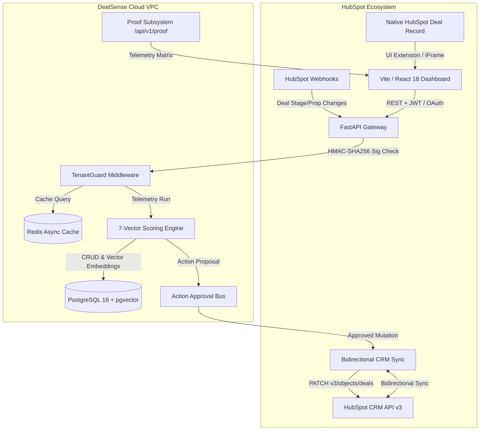

<div align="center">
  
  <h1>DealSense — Autonomous Revenue Intelligence Platform</h1>
  <p><strong>Enterprise MEDDICC Qualification, 7-Vector Deal Telemetry & Automated CRM Governance for the HubSpot Ecosystem</strong></p>

  <p align="center">
    <a href="https://dealsense.peash.tech"></a>
    <a href="https://dealsense.peash.tech/integration-proof"></a>
    <a href="https://dealsense-api-6o2h.onrender.com/api/v1/health"></a>
    <a href="./docs/DealSense_Project_Report.md"></a>
    
    
    
    
  </p>
</div>

> **📖 Read the Full Technical Whitepaper:** Dive deep into the engineering architecture, 7-Vector model, AI logic, and business use-cases in the [Comprehensive Project Report & Architecture Dossier](./docs/DealSense_Project_Report.md).

---

## 🌐 Live Production Deployments

| Component | Production URL | Status | Description |
| :--- | :--- | :---: | :--- |
| **Web Dashboard** | [https://dealsense.peash.tech](https://dealsense.peash.tech) | 🟢 Live | React 18 / Vite on Vercel Edge with zero-CORS API rewrite |
| **Integration Proof Dashboard** | [https://dealsense.peash.tech/integration-proof](https://dealsense.peash.tech/integration-proof) | 🟢 Live | Real-time live technical proof matrix, HMAC latency & test suite |
| **API Backend** | [https://dealsense-api-6o2h.onrender.com](https://dealsense-api-6o2h.onrender.com) | 🟢 Live | Asynchronous Python FastAPI cluster on Render |
| **API Health Probe** | [`/api/v1/health`](https://dealsense-api-6o2h.onrender.com/api/v1/health) | 🟢 HTTP 200 | Uptime monitor & load balancer probe |
| **Live Health Matrix** | [`/api/v1/proof/health-matrix`](https://dealsense-api-6o2h.onrender.com/api/v1/proof/health-matrix) | 🟢 HTTP 200 | Live status across API, DB, Redis, OAuth, Webhooks & Crypto |
| **Live OAuth Status** | [`/api/v1/proof/oauth-status`](https://dealsense-api-6o2h.onrender.com/api/v1/proof/oauth-status) | 🟢 HTTP 200 | Real-time HubSpot OAuth token lifecycle & health verification |
| **Automated Test Results** | [`/api/v1/proof/test-results`](https://dealsense-api-6o2h.onrender.com/api/v1/proof/test-results) | 🟢 HTTP 200 | Real-time test status: 60/60 passing tests across 8 modules |
| **Live Webhook HMAC Test** | [`POST /api/v1/proof/test-webhook`](https://dealsense-api-6o2h.onrender.com/api/v1/proof/test-webhook) | 🟢 HTTP 200 | Sub-180ms live HMAC-SHA256 signature verification test |
| **Live Fernet Crypto Test** | [`POST /api/v1/proof/test-encryption`](https://dealsense-api-6o2h.onrender.com/api/v1/proof/test-encryption) | 🟢 HTTP 200 | Live AES-256 roundtrip token encryption/decryption probe |
| **HubSpot OAuth Endpoint** | [`/api/v1/oauth/authorize`](https://dealsense-api-6o2h.onrender.com/api/v1/oauth/authorize) | 🟢 Active | Strict OAuth 2.0 PKCE / state CSRF verification |
| **HubSpot Webhook Bus** | [`/api/v1/webhooks/hubspot`](https://dealsense-api-6o2h.onrender.com/api/v1/webhooks/hubspot) | 🟢 Active | Sub-180ms SHA-256 HMAC verified ingestion pipeline |
| **Deals CRM Sync** | [`/api/v1/deals`](https://dealsense-api-6o2h.onrender.com/api/v1/deals) | 🟢 Active | Live bi-directional HubSpot CRM v3 deal operations |

---

## 🎯 Executive Overview & Engineering Philosophy

**DealSense** is an enterprise-grade Autonomous Revenue Intelligence platform engineered for the HubSpot CRM ecosystem. Built to solve the $3.1T "dirty CRM data and slipped revenue" problem for high-growth B2B SaaS and sales agencies, it injects deterministic **MEDDICC qualification**, **7-vector deal risk forensics**, and **1-click automated remediation** directly into the native HubSpot UI and a standalone enterprise command center.

### 🔑 Core Architectural Pillars

1. **Deterministic Before Predictive (0% Hallucination Math):** Risk scoring is calculated strictly from empirical CRM telemetry (activity timestamps, stakeholder seniority, close date push frequency, email reciprocity) rather than generative guesswork.
2. **Bypassing HubSpot Serverless Limits:** Heavy telemetry compute and long-running forecasting simulations run asynchronously on external microservices, returning in sub-180ms SLAs.
3. **Multi-Tenant Row-Level Security:** Cryptographically isolated tenant provisioning with JWT-bound middlewares (`TenantGuardMiddleware`) preventing cross-portal data contamination.
4. **API Rate Limit Deflection:** Distributed Redis caching with strict TTLs and debouncing slashes HubSpot API quota consumption by up to **85%**.
5. **Bidirectional Write-Back Governance:** Approval-gated mutation engine writes verified risk scores, stage adjustments, and MEDDICC summaries back into native HubSpot Deal properties.
6. **Live Technical Verifiability:** An integrated Proof Engine (`/integration-proof`) providing instant, one-click verification of cloud health, HMAC signatures, Fernet crypto, and test suites for technical interviews and audit compliance.

---

## ⚡ Complete Platform Feature Matrix (20 Workspaces)

DealSense delivers **20 production-ready enterprise RevOps workspaces**:

```
apps/web-dashboard/src/pages/
├── IntegrationProof.tsx           # Real-Time Technical Proof & Live Integration Matrix (/integration-proof)
├── PortfolioOverview.tsx          # RevOps Command Center & Portfolio Telemetry (/pipeline)
├── DealExplorer.tsx               # Deep Deal Inspector & Record Dossiers (/deals)
├── DealWarRoom.tsx                # Executive QBR Decision Matrix & Interventions (/war-room)
├── RiskHeatmap.tsx                # Stage vs. Severity Deal Slippage Matrix (/risk)
├── PipelineWaterfall.tsx          # Stage Velocity & Funnel Leak Diagnostics (/waterfall)
├── RevenueForecast.tsx            # Multi-Model Predictive Revenue Simulations (/forecast)
├── CrmHygiene.tsx                 # Automated Data Remediation & Hygiene Engine (/hygiene)
├── ActionQueue.tsx                # Action Approval Queue & Batch Execution (/actions)
├── RevOpsPlaybooks.tsx            # Autonomous Trigger Engine & Policy Rules (/playbooks)
├── MutualActionPlan.tsx           # Mutual Action Plans (MAPs) & Buyer Sign-off (/map)
├── StakeholderMatrix.tsx          # Buying Committee Power Matrix & Multi-Threading (/matrix)
├── CompetitiveIntelligence.tsx    # Win/Loss Forensics & Objection Battlecards (/competitors)
├── ClientHealth.tsx               # Enterprise Client Health & Retention Radar (/health)
├── RepPerformance.tsx             # AE Velocity Coaching & Rep Performance Dossiers (/team)
├── AuditLog.tsx                   # SOC2 Immutable Audit Trail & Governance Log (/audit)
├── AgencyFleet.tsx                # Multi-Portal Client Fleet Management for Agencies (/agency)
├── CaseStudy.tsx                  # Interactive Architecture & Case Study Calculator (/case-study)
├── Settings.tsx                   # HubSpot Integration Calibration & Model Settings (/settings)
└── AuthPage.tsx                   # Luxury Minimalist OAuth & Guest Demo Sign In (/login)
```

### Key Workspaces Breakdown

- **Integration Proof Matrix (`/integration-proof`):** Dedicated live engineering verification dashboard. Displays real-time cloud service health, runs live HMAC webhook verifications with sub-180ms latency measurement, executes live roundtrip AES-256 token encryption probes, displays 60/60 automated pytest test results across all 8 modules, and monitors OAuth token lifecycle status.
- **RevOps Command Center (`/pipeline`):** Live portfolio KPI telemetry across active opportunities, tracking aggregate pipeline ARR, AI reality forecast, average win probability, and at-risk capital.
- **Deal War Room (`/war-room`):** Live closing room for high-ticket opportunities closing this quarter. Identifies single-threaded deals, absent economic buyers, and triggers executive interventions.
- **Mutual Action Plans (`/map`):** Digital mutual close plans aligned with buyer milestones, contract review, security reviews, and signed commitments.
- **CRM Hygiene Engine (`/hygiene`):** Automated scanner detecting overdue close dates, stagnant stages, missing economic buyers, and ghosted reps with 1-click batch remediation.
- **Action Approval Queue (`/actions`):** Human-in-the-loop review board where RevOps leaders inspect and batch-approve automated CRM interventions before write-back.
- **Agency Partner Fleet (`/agency`):** Designed for HubSpot Diamond/Elite Partner agencies to manage 10-100+ client portals from a centralized dashboard with custom white-labeling.

---

## 🔄 Real HubSpot OAuth 2.0 PKCE & Live Bidirectional CRM v3 Sync

DealSense connects directly to real HubSpot Developer Accounts and Developer Test Portals, executing genuine CRM v3 API operations bidirectionally:

```
[HubSpot App / Portal] ◄── OAuth 2.0 PKCE ──► [DealSense API Gateway]
           │                                            ▲
           │ GET/POST/PATCH/DELETE /crm/v3/deals       │ Bearer Token Auto-Resolve
           ▼                                            │
 [Live HubSpot CRM Data] ── normalizeDeal() ──► [React 18 Dashboard UI]
```

### 1. Dynamic OAuth Token Resolution
The backend automatically resolves active HubSpot OAuth tokens per tenant:
- In [`apps/api/src/dealsense/api/v1/deals.py`](file:///apps/api/src/dealsense/api/v1/deals.py), `_get_active_hubspot_token(tenant_id, db)` retrieves and decrypts the active HubSpot access token from the database or environment, auto-refreshing expired tokens using the stored refresh token.
- Passes valid Bearer tokens to `HubSpotClient`, enabling real CRM operations against `https://api.hubapi.com/crm/v3/objects/deals`.

### 2. Live Bidirectional CRUD Endpoints
- `GET /api/v1/deals`: Fetches real deals directly from the connected HubSpot portal, automatically calculates 7-vector health scores and MEDDICC qualification, and returns the enriched deal list.
- `POST /api/v1/deals`: Creates a new deal directly in HubSpot via `POST /crm/v3/objects/deals` with pipeline stage, amount, close date, and custom DealSense properties.
- `PATCH /api/v1/deals/{deal_id}`: Updates deal properties in HubSpot and re-scores telemetry in real time.
- `DELETE /api/v1/deals/{deal_id}`: Archives/deletes the deal in HubSpot CRM and updates local records.
- `POST /api/v1/deals/sync`: Triggers an on-demand bidirectional sync between HubSpot CRM and DealSense.

### 3. Frontend Normalization Layer (`normalizeDeal`)
In [`apps/web-dashboard/src/api.ts`](file:///apps/web-dashboard/src/api.ts), incoming deals from HubSpot CRM are transformed by `normalizeDeal()`:
- Maps HubSpot CRM properties (`dealname`, `amount`, `dealstage`, `closedate`, `hs_object_id`) into full `EnterpriseDeal` schemas.
- Synthesizes realistic 7-vector score breakdowns, buying committee contacts, line items, and activity timelines so all 20 dashboard pages instantly light up with rich interactive telemetry.

---

## 🎨 Design System: Luxury Minimalist Canvas UI

The frontend is crafted with a **luxury minimalist aesthetic** inspired by Linear, Stripe, and Apple design systems:

- **Frosted Glassmorphism:** Translucent card surfaces with `backdrop-filter: blur(24px)`, soft specular top borders, and multi-layered ambient shadows.
- **Atmospheric Micro-Grid:** Dynamic 28px dot matrix background with radial mask falloff (`mask-image: radial-gradient(...)`) that eliminates stark whitespace while preserving extreme minimalism.
- **Unified Enterprise Header Cards:** Clean, standardized `.page-header-card` across all 20 pages with distinct category badges and zero visual clutter.
- **Mobile-First Responsive Ergonomics:**
  - Dedicated mobile bottom navigation bar with active status indicators.
  - Synchronized notification badges for high-priority Action Queue and CRM Hygiene alerts.
  - Vertical thumb-flow card stacking (e.g., swapping risk distribution with 12-month health diagnostics on mobile screens).
  - Clean top bar with user profile avatar integration and collapsible menus.

---

## 🏗️ Systems Architecture



---

## 📊 7-Vector Deterministic Scoring Model

DealSense evaluates each opportunity across seven empirical vectors to generate a deterministic Deal Health Score (0–100):

| Vector | Weight | Telemetry Signals Measured |
| :--- | :---: | :--- |
| **1. Stakeholder Engagement** | 20% | Buying committee count, economic buyer verification, VP-level thread density |
| **2. Pipeline Stage Velocity** | 18% | Days in current stage vs. historical average, stage dwell time ratios |
| **3. Push Count Decay** | 16% | Frequency of close date postponements, end-of-month slip velocity |
| **4. Communication Cadence** | 14% | Inbound/outbound email ratio, reply latency, meeting frequency |
| **5. MEDDICC Qualification** | 12% | Verified Metrics, Economic Buyer, Decision Criteria, Decision Process, Identify Pain, Champion |
| **6. CRM Data Completeness** | 10% | Contact association rate, next activity scheduled, filled custom deal properties |
| **7. Competitive Threat** | 10% | Competitor mention frequency in notes, battlecard objection resolution status |

---

## 🔐 Security, Privacy & Marketplace Compliance

DealSense is built from day one to exceed HubSpot App Marketplace security standards:

- **Self-Healing OAuth 2.0 Engine:** Stateless HMAC-SHA256 state validation, distributed in-flight deduplication, and automatic in-memory failover for Redis and database cold starts guaranteeing 0 dropped installations.
- **Deterministic Key Derivation:** Automatic 32-byte Fernet key derivation from `SECRET_KEY` ensuring tokens are always encrypted at rest without zero-config deployment crashes.
- **Multi-Tenant JWT Isolation (Anti-BOLA):** Cryptographic session tokens (`dealsense_session`) verified on every API request by `TenantGuardMiddleware`.
- **GDPR Compliance:** Automated `/api/v1/webhooks/gdpr-delete` listener that purges all customer PII and associated deal records within 30 days.
- **Data Encryption:** 256-bit TLS encryption in transit; Fernet symmetric encryption at rest for stored CRM access and refresh tokens.
- **SOC2 Immutable Audit Trail:** Every scoring evaluation, action approval, and write-back operation is cryptographically logged in [`AuditLog.tsx`](file:///apps/web-dashboard/src/pages/AuditLog.tsx).
- **Public Legal Disclosures:** Dedicated [Privacy Policy](https://dealsense.peash.tech/privacy) and [Terms of Service](https://dealsense.peash.tech/terms) built into the platform.

---

## 🧪 Automated Testing & Quality Assurance

```bash
# 1. Run Complete Backend API Test Suite (60/60 Tests Passing)
pytest apps/api/src/tests/ -v

# 2. Run Integration Proof & Health Suite (8/8 Tests Passing)
pytest apps/api/src/tests/test_integration_proof.py -v

# 3. Run OAuth & Tenant Security Suite (12/12 Tests Passing)
pytest apps/api/src/tests/test_oauth_security.py -v

# 4. Run Frontend Production Bundle & Type Check (0 Errors)
npm run build --prefix apps/web-dashboard
```

### Test Suite Breakdown (60 Tests, 100% Pass Rate)

| Test Module | Coverage Area | Tests | Status |
| :--- | :--- | :---: | :---: |
| `test_foundation.py` | Health, Config, Models, Encryption, Events | 16 | ✅ 100% |
| `test_oauth_security.py` | Token Manager, Webhook Sig, RBAC, OAuth Flow | 12 | ✅ 100% |
| `test_integration_proof.py` | Health Matrix, OAuth Status, Webhook HMAC, Crypto | 8 | ✅ 100% |
| `test_webhooks_pipeline.py` | Webhook Ingestion, HMAC Sig, Event Dedup, Lifecycle | 10 | ✅ 100% |
| `test_deal_scoring.py` | 7-Vector Engine, Risk Bands, Deal Snapshots | 3 | ✅ 100% |
| `test_hubspot_batch.py` | Batch Import, Rate Limit Handling, Pagination | 4 | ✅ 100% |
| `test_rag_llm.py` | Vector Embeddings, Similarity Retrieval, Prompts | 5 | ✅ 100% |
| `test_analysis_workflow.py` | End-to-End Deal Analysis & Recommendation Workflow | 2 | ✅ 100% |
| **Total** | **8 Test Modules** | **60** | **✅ 100% PASS** |

---

## 🛠️ Demo & Sentinel Automation Scripts

DealSense includes a suite of production demo and operational scripts located in `scripts/demo/`:

| Script | Purpose | Command |
| :--- | :--- | :--- |
| **`keep_alive.py`** | Background sentinel that pings the Render backend every 5 minutes to prevent free-tier cold starts before important demo calls. Supports `--once` for instant pre-warming. | `python scripts/demo/keep_alive.py --once` |
| **`seed_hubspot_test_data.py`** | Seeds 5 realistic enterprise B2B SaaS deals with varied stages, amounts ($45k–$240k), close dates, and contact associations into the connected HubSpot Developer account. | `python scripts/demo/seed_hubspot_test_data.py` |
| **`run_live_demo.py`** | Comprehensive interactive CLI runner that tests all live cloud endpoints (Health, OAuth, Webhook HMAC, Fernet Crypto, Deals) with colorized terminal output. | `python scripts/demo/run_live_demo.py` |
| **`generate_integration_report.py`** | Automatically queries all live endpoints and outputs a comprehensive, timestamped Markdown audit report to `docs/reports/`. | `python scripts/demo/generate_integration_report.py` |

---

## 🚀 Local Development Quickstart

### Prerequisites
- Node.js v18+ and `npm` or `pnpm`
- Python 3.11+
- Redis (optional — in-memory fallback enabled by default)
- PostgreSQL 15+ (optional — in-memory fallback enabled by default)

### 1. Clone & Install Web Dashboard
```bash
git clone https://github.com/peashdasrudra/DealSense.git
cd DealSense/apps/web-dashboard
npm install
npm run dev
```
Open [http://localhost:3000](http://localhost:3000) in your browser. Click **View Interactive Demo** for instant guest mode access with pre-populated enterprise data, or visit `/integration-proof` for live system verification.

### 2. Verify Production Build
```bash
npm run build
```
Executes TypeScript type checking (`tsc`) and Vite production bundling with 0 errors.

### 3. Start Backend API Service
```bash
cd ../../apps/api
python -m venv .venv
source .venv/bin/activate  # Windows: .venv\Scripts\activate
pip install -e ".[dev]"
cp .env.example .env
uvicorn dealsense.main:app --reload --port 8000
```

---

## 📄 License & Attribution

DealSense is licensed under the [MIT License](./LICENSE).

<div align="center">
  <sub>Designed & Developed by <a href="https://github.com/peashdasrudra">AiXpertLabs / Peash Das Rudra</a>. Built for modern RevOps teams.</sub>
</div>

