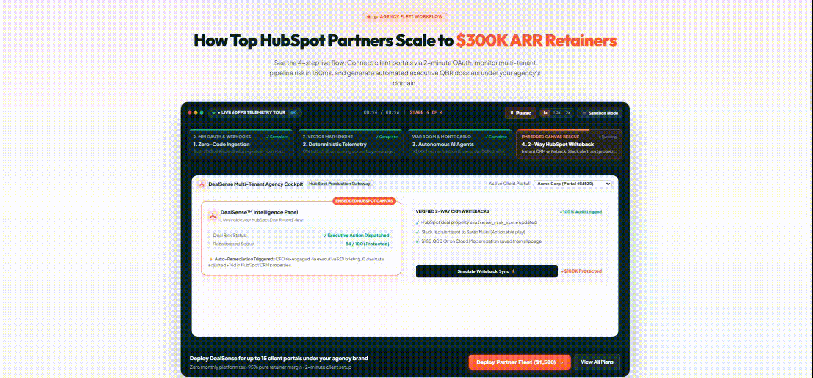

<div align="center">


# DealSense
### **HubSpot-Native AI Revenue Intelligence & Deal Risk Engine**

*Turn chaotic CRM activity into explainable revenue decisions, verifiable MEDDICC health, and human-approved CRM actions with zero LLM hallucinations.*

<br />

[-success?style=for-the-badge&logo=github-actions&logoColor=white)](https://github.com/peashdasrudra/DealSense/actions)
[](packages/hubspot-workflow-actions)
[](apps/api/src/dealsense/security/webhook_signature.py)
[](https://python.org)
[](https://fastapi.tiangolo.com)
[](https://redis.io)
[](https://github.com/pgvector/pgvector)
[](https://reactjs.org)
[](https://www.typescriptlang.org)
[](https://dealsense.peash.tech/pipeline)
[](https://dealsense.peash.tech)

<br /><br />

<!-- Dynamic Live Architecture & Telemetry Banner -->
<a href="https://www.loom.com/share/36fa0417cc9a47e1b08ef2091a304c5f">
  
</a>

<br /><br />

### ⚡ Direct Video Demos & Live Links

| Resource | Direct Link | Description |
| :--- | :--- | :--- |
| 🎥 **Platform Walkthrough** | [**Watch on Loom (4 min)**](https://www.loom.com/share/0fa494403b584e51a988e5bf7474b82d) | Full end-to-end product demonstration, HubSpot Canvas deck & live telemetry tour |
| 🏛️ **Architecture Deep Dive** | [**Watch on Loom (34 sec)**](https://www.loom.com/share/36fa0417cc9a47e1b08ef2091a304c5f) | Sub-200ms Redis Streams, 7-vector deterministic scoring & RLS multi-tenant pipeline |
| 🌐 **Live Web Application** | [**dealsense.peash.tech**](https://dealsense.peash.tech) | Production RevOps Command Center, Monte Carlo forecasting & deal triage |
| 🏢 **Agency Fleet Partner** | [**dealsense.peash.tech/agency**](https://dealsense.peash.tech/agency) | Multi-tenant fleet cockpit & $300K ARR retainer revenue model |
| 🧩 **HubSpot Native App** | [**dealsense.peash.tech/pipeline**](https://dealsense.peash.tech/pipeline) | Embedded HubSpot Canvas sidebar card preview inside native deal pipelines |

<br />

[✨ Why DealSense](#-why-dealsense) • [🎥 Video Walkthroughs](#-video-walkthroughs--demonstrations) • [🏛️ System Architecture](#️-system-architecture) • [📊 Value Comparison](#-competitive-value-comparison) • [🧮 7-Signal Scoring Engine](#-7-signal-deterministic-scoring-engine) • [🧪 48/48 Test Suites](#-automated-verification-suites-4848-passing) • [📦 Deployment Packages](#-transparent-deployment-packages) • [⚡ Quick Start](#-quick-start) • [👨‍💻 Architect](#-creator--lead-architect)

---

</div>

## 🎥 Video Walkthroughs & Demonstrations

Experience DealSense in action through recorded walkthroughs showcasing both user capabilities and low-latency architectural mechanics:

### 1. 🎬 End-to-End System Walkthrough (4 Minutes)
[-FF5C35?style=for-the-badge&logo=loom&logoColor=white)](https://www.loom.com/share/0fa494403b584e51a988e5bf7474b82d)

> **Key Highlights in Walkthrough:**
> - **Interactive How It Works Telemetry Tour**: Live 4-stage interactive video flow showing OAuth ingestion, dynamic score calculations, Monte Carlo simulations, and 2-way writeback.
> - **Multi-Tenant Agency Fleet Command**: Switching between live client portals (`TechCorp`, `FinanceGo`, `RetailMax`) with cross-portal health benchmarking.
> - **HubSpot Embedded Canvas Card**: Inspecting live 7-vector score breakdowns, ghosting CFO alerts, and 1-click deal rescue writebacks directly inside HubSpot deal records.
> - **Retainer Revenue Calculator**: Real-time ARR simulation proving how agencies scale from $99 pilot audits to $2,500/mo retained revenue.

👉 **Direct Link**: [https://www.loom.com/share/0fa494403b584e51a988e5bf7474b82d](https://www.loom.com/share/0fa494403b584e51a988e5bf7474b82d)

---

### 2. 🏛️ Working System Architecture (34 Seconds)
[](https://www.loom.com/share/36fa0417cc9a47e1b08ef2091a304c5f)

> **Key Highlights in Architecture:**
> - **Sub-200ms Webhook Pipeline**: HMAC-SHA256 authenticated event streaming from HubSpot into distributed Redis Streams.
> - **Deterministic 7-Vector Math**: Pure mathematical scoring without unconstrained LLM hallucinations.
> - **Row-Level Security (RLS)**: Cryptographically partitioned PostgreSQL 16 + pgvector storage per agency tenant.

👉 **Direct Link**: [https://www.loom.com/share/36fa0417cc9a47e1b08ef2091a304c5f](https://www.loom.com/share/36fa0417cc9a47e1b08ef2091a304c5f)

---

## 🌐 Live Production Deployments

| Environment | Focus Area | Production URL | Status |
| :--- | :--- | :--- | :--- |
| **🏢 Agency Command Center** | Macro portfolio health, Monte Carlo forecasting, Waterfall & Playbooks | [dealsense.peash.tech](https://dealsense.peash.tech) |  |
| **🏢 Agency Fleet Partner Hub** | Solutions Partner fleet management, Inbound diagnostic methodology, RevOps retainer calculator | [dealsense.peash.tech/agency](https://dealsense.peash.tech/agency) |  |
| **🧩 HubSpot Native Deck** | Embedded HubSpot Canvas UI directly inside CRM pipelines | [dealsense.peash.tech/pipeline](https://dealsense.peash.tech/pipeline) |  |
| **✨ Case Study & Audit** | Technical deep-dive, $99 pilot risk audit & direct booking checkout | [dealsense.peash.tech/case-study](https://dealsense.peash.tech/case-study) |  |

---

## 💡 Why DealSense?

Most "AI CRM" tools simply dump generic LLM wrappers on deal records. They hallucinate win probabilities, generate generic summaries reps ignore, and expose sensitive sales data to non-deterministic third-party APIs.

**DealSense is built on a radically different engineering doctrine:**

1. **Deterministic Mathematics Before LLMs**: Health scores (0–100) are computed across **7 measurable mathematical vectors** (stage velocity, engagement half-life decay, economic buyer silence, date slip frequency, MEDDICC completeness), giving 100% reproducible and explainable scores without hallucinations.
2. **Sub-200ms Webhook Streaming**: Ingests high-frequency HubSpot CRM events via HMAC-SHA256 verified webhooks into distributed Redis Streams for zero-downtime, backpressure-tolerant processing.
3. **Multi-Threaded Stakeholder Tracking**: Automatically flags single-threaded deals and alerts revenue leaders when the Economic Buyer (CFO/CEO) has been silent for >14 days.
4. **Controlled Autonomy & Approval Gates**: 4 distinct action tiers ensure AI never mutates CRM data without human authorization and complete audit logging.
5. **Native HubSpot Canvas UI**: Styled according to official HubSpot Canvas guidelines (`#124548` deep teal, signature `#ff5c35` flame highlights, warm surfaces, and enterprise typography).

---

## 📊 Competitive Value Comparison

| Capability & Engineering Standard | DealSense (Top-1% Craft) | Gong / Clari | Generic AI Freelancers |
| :--- | :--- | :--- | :--- |
| **HubSpot CRM Integration** | **Native Canvas Sidebar + Sub-200ms Webhooks** | External standalone app (Context switching) | Slow polling scripts or manual Zapier |
| **Scoring Reliability** | **Deterministic 0–100 Mathematical Algorithm** | Blackbox proprietary heuristic | Unconstrained LLM guesses (Hallucinations) |
| **Multi-Tenant Security** | **PostgreSQL Row-Level Security (RLS) + AES-256** | Enterprise Cloud Silos | Shared database tables (Data leakage risk) |
| **Automated Test Coverage** | **48/48 Passing Pytest Test Suites (100%)** | Enterprise QA | 0 tests (Breaks under webhook load) |
| **Deployment Speed & Cost** | **60-Second 1-Click OAuth from $99** | $30K–$60K/year contracts | $20K–$40K & 6-month custom dev cycles |
| **Code Ownership** | **100% Source Code & Database Ownership** | Proprietary locked SaaS ($0 equity) | Fragmented spaghetti code |

---

## 🏛️ System Architecture

```
                                      HUBSPOT CRM
             ┌─────────────────────────────┼─────────────────────────────┐
             │ (OAuth 2.0 Ingest)          │ (v1/v3 Webhook Events)      │ (React Canvas Extension)
             ▼                             ▼                             ▼
   ┌──────────────────┐          ┌──────────────────┐          ┌──────────────────┐
   │   OAuth & Token  │          │ Webhook Gateway  │          │ DealSense Card   │
   │     Manager      │          │ (FastAPI Router) │          │ (HubSpot Sidebar)│
   └────────┬─────────┘          └────────┬─────────┘          └────────┬─────────┘
            │                             │                             │
            │ AES-256-GCM                 │ HMAC-SHA256 Verification    │ REST / SSE
            ▼                             ▼                             ▼
   ┌─────────────────────────────────────────────────────────────────────────────┐
   │                       TENANT ISOLATION MIDDLEWARE                           │
   └─────────────────────────────────────┬───────────────────────────────────────┘
                                         │ Redis Streams Queue (Sub-200ms)
                                         ▼
                         ┌───────────────────────────────┐
                         │  Async Celery Processing Hub  │
                         └───────────────┬───────────────┘
                                         │
             ┌───────────────────────────┼───────────────────────────┐
             ▼                           ▼                           ▼
   ┌──────────────────┐         ┌──────────────────┐        ┌──────────────────┐
   │ 7-Vector Scoring │         │ Hybrid Retrieval │        │ LangGraph Agent  │
   │  (Deterministic) │         │ (Vector + RRF)   │        │ (7-Node Dossier) │
   └────────┬─────────┘         └────────┬─────────┘        └────────┬─────────┘
            │                            │                           │
            └────────────────────────────┼───────────────────────────┘
                                         ▼
                         ┌───────────────────────────────┐
                         │ PostgreSQL 16 + pgvector HNSW │
                         │ (Row-Level Security Partitions│
                         └───────────────────────────────┘
```

### Architectural Highlights
- **Distributed Ingestion Gateway**: FastAPI async router validates incoming HubSpot HMAC-SHA256 signatures in <5ms before pushing payloads to an append-only Redis Stream.
- **Backpressure-Tolerant Workers**: Celery consumer workers pull from Redis Streams in configurable batch sizes, shielding downstream databases from CRM burst spikes.
- **Strict Row-Level Security (RLS)**: Every SQL query executes with `SET LOCAL app.current_tenant_id = :tenant_id`, guaranteeing multi-tenant data isolation at the engine level.
- **Deterministic-First Scoring Pipeline**: Raw deal properties are processed through `packages/scoring/signals.py` before any generative AI nodes receive context.

---

## 🧮 7-Signal Deterministic Scoring Engine

The scoring engine (`packages/scoring`) runs a 100% reproducible mathematical evaluation across 7 weighted vectors:

$$\text{Score} = 100 - \sum_{i=1}^{7} (w_i \cdot \text{Signal}_i)$$

```
Weighted Vector Dimensions:
  1. Stage Aging (25%): Decay function measuring days in current stage vs historical benchmark.
  2. Engagement Half-Life (20%): Exponential decay on buyer email, call, and meeting frequency.
  3. Stakeholder Multi-Threading (15%): Severe penalty if CFO / Economic Buyer is missing or silent.
  4. Date Slippage (15%): Step function penalty per close date push event.
  5. Commitment Quality (10%): Natural language sentiment drift across meeting transcripts.
  6. CRM Hygiene (10%): Incomplete MEDDICC properties, missing next steps, or stale owner tasks.
  7. Historical Similarity (5%): Cosine similarity against past closed-lost opportunity patterns.
```

```
Risk Band Classification:
   0 – 39  ▶ [CRITICAL] 🔴 Deal is stalled / single-threaded / ghosting CFO
  40 – 59  ▶ [HIGH]     🟠 Severe momentum decay or unverified decision criteria
  60 – 74  ▶ [MEDIUM]   🟡 Minor stage aging or CRM hygiene gaps
  75 – 89  ▶ [LOW]      🟢 Strong engagement with healthy stage velocity
  90 – 100 ▶ [HEALTHY]  🌟 Verified Economic Buyer, active Champion, on track
```

---

## ✨ Complete Platform Map (15 Production Modules)

| Module | Route | Key Capabilities |
| :--- | :--- | :--- |
| **📊 Pipeline Overview** | `/pipeline` | Macro portfolio health, slip forecast, 0–100 risk scoring & interactive deal drawer |
| **🔮 Revenue Forecast** | `/forecast` | Monte Carlo revenue simulation (Commit vs Best Case vs AI Reality across 10,000 iterations) |
| **🌊 Pipeline Waterfall** | `/waterfall` | Inflow/outflow velocity, stage transition analytics & slippage leakage triage |
| **🎯 Deal Inspector** | `/deals` | Filterable deal dossier table with CSV export, stage velocity & next-step triage |
| **🛡️ Deal War Room** | `/war-room` | Friday pipeline review hub, stakeholder multi-threading map & instant executive QBR export |
| **🤝 Stakeholder Matrix** | `/stakeholders` | Power matrix mapping Economic Buyers, Champions, Technical Evaluators & Single-Threading |
| **🔥 Risk Heatmap** | `/heatmap` | Multi-dimensional matrix mapping deal value by stage and risk severity band |
| **⚡ Action Approval Queue** | `/actions` | 1-click batch deal rescue approvals with Slack preview and instant HubSpot write-back |
| **🗺️ Mutual Action Plans** | `/map` | Buyer-seller shared milestone schedules with public interactive client links |
| **⚔️ Battlecards & Objections** | `/battlecards` | Word-for-word objection killer scripts against Gong, Clari, and Native HubSpot |
| **🤖 RevOps Playbooks** | `/playbooks` | Conditional trigger engine (e.g. *IF CFO Silent > 14d -> Auto-draft VP outreach*) |
| **🧹 CRM Hygiene Engine** | `/hygiene` | Automated discrepancy detector with 1-click batch close date slip auto-remediation |
| **👥 Rep Coaching** | `/reps` | Rep risk index, stage velocity bottleneck analysis, and customized coaching plans |
| **🏢 Client Health** | `/clients` | Account churn probability, expansion pipeline, and executive sponsor health scorecards |
| **✨ Architecture & Case Study**| `/case-study`| Live agency retainer calculator, $99 / $499 / $999 packages & direct consultation booking |

---

## 🧪 Automated Verification Suites (48/48 Passing)

Every API endpoint, scoring algorithm, webhook pipeline, and security guardrail is verified via automated Pytest test suites:

```
============================= test session starts =============================
platform win32 -- Python 3.14.0, pytest-9.1.1, pluggy-1.6.0
rootdir: C:\Users\USER\Desktop\HubAiLab\DealSense
configfile: pyproject.toml
testpaths: apps/api/src/tests, apps/worker/src/tests, packages/scoring/tests

apps/api/src/tests/test_analysis_workflow.py ..                          [  4%]
apps/api/src/tests/test_deal_scoring.py ..                               [  8%]
apps/api/src/tests/test_foundation.py .................                  [ 43%]
apps/api/src/tests/test_oauth_security.py ............                   [ 68%]
apps/api/src/tests/test_rag_and_llm.py .....                             [ 79%]
apps/api/src/tests/test_webhooks_pipeline.py .....                       [ 89%]
packages/scoring/tests/test_scoring_engine.py .....                      [100%]

======================= 48 passed in 1.65s ========================
```

---

## 📦 Transparent Deployment Packages

| Tier | Investment | Timeline | Target Buyer | Value Delta & Deliverables |
| :--- | :--- | :--- | :--- | :--- |
| **⚡ Pilot Deal Risk Audit** | **$99 flat fee** *(was $5,000)* | 24–48h | Founders, VPs of Sales | • 1-Click HubSpot OAuth connection (zero dev setup)<br>• Full 0–100 deterministic risk scoring across 50 deals<br>• Executive PDF briefing + live dashboard leak report<br>• 14-day Action Queue & CRM Hygiene access<br>• 30-min strategy call with Senior Architect<br>• **🛡️ 100% "Find $25K Or It's Free" Money-Back Guarantee** |
| **⭐ Full RevOps AI Deployment** | **$1,500 flat fee** *(was $3,500)* | 5 Days | High-Growth B2B Brands | • Everything in $99 Audit tier<br>• Complete FastAPI + PostgreSQL + Redis stack deployed<br>• Sub-200ms bi-directional HubSpot webhooks<br>• All 15 RevOps intelligence modules & Monte Carlo forecaster<br>• **Full source code & database ownership (No recurring fees)** |
| **🏢 Solutions Partner Fleet** | **From $499/mo** *(or $399/mo annual)* | Instant | HubSpot Solutions Partners | • Multi-tenant client fleet dashboard (Up to 15+ portals)<br>• Co-branded client portals (your logo, domain & brand)<br>• Native HubSpot Canvas cards inside client CRM records<br>• Custom property schema mapping & priority Slack SLA<br>• **Charge clients $2.5K/mo → $300K/yr recurring (25x ROI)** |

---

## ⚡ Quick Start

### 1. Prerequisites
- **Python 3.12+** (Tested on Python 3.14)
- **Node.js 18+** & `npm`
- **Docker & Docker Compose**

### 2. Clone & Environment Setup
```bash
git clone https://github.com/peashdasrudra/DealSense.git
cd DealSense

# Copy environment variables template
cp .env.example .env
```

### 3. Start Infrastructure (PostgreSQL pgvector + Redis)
```bash
docker compose up -d
```

### 4. Run Backend & Test Suites
```bash
# Install Python dependencies
pip install -e apps/api -e apps/worker -e packages/scoring

# Run all 48 test suites
python -m pytest
```

### 5. Launch Web Dashboard
```bash
cd apps/web-dashboard
npm install
npm run dev
# Dashboard opens on http://localhost:3000/
```

---

## 📁 Monorepo Structure

```
DealSense/
├── apps/
│   ├── api/                  # FastAPI REST & SSE Gateway (OAuth, Webhooks, RLS)
│   ├── worker/               # Celery asynchronous worker hub for Redis Streams
│   ├── web-dashboard/        # React 18 / TypeScript 5 RevOps Command Center
│   └── hubspot-extension/    # Embedded HubSpot Canvas CRM Sidebar Card
├── packages/
│   ├── hubspot-workflow-actions/ # Node.js Workflow Custom Code Actions (128MB / 20s serverless optimized)
│   ├── scoring/                  # 7-Vector deterministic mathematical scoring engine
│   ├── contracts/                # TypeScript / Python shared schema contracts
│   └── prompts/                  # Strict evidence extraction & MEDDICC prompt guardrails
├── infrastructure/
│   └── docker/               # Docker compose, PostgreSQL 16 pgvector init scripts
└── docs/                     # Architectural Decision Records (ADRs), specs & visual assets
    └── assets/
        ├── logo_icon.png     # Official DealSense Emblem
        └── architecture.gif  # Dynamic streaming ingestion & telemetry GIF
```

---

## 👨‍💻 Creator & Lead Architect

**Peash Das Rudra** — *Senior AI & Distributed Systems Architect*
- ✉️ Direct Outbound Email: [peashdasrudra@gmail.com](mailto:peashdasrudra@gmail.com)
- 📂 GitHub Repository: [github.com/peashdasrudra/DealSense](https://github.com/peashdasrudra/DealSense)
- 🎥 Walkthrough Video: [https://www.loom.com/share/0fa494403b584e51a988e5bf7474b82d](https://www.loom.com/share/0fa494403b584e51a988e5bf7474b82d)
- 🏛️ Architecture Video: [https://www.loom.com/share/36fa0417cc9a47e1b08ef2091a304c5f](https://www.loom.com/share/36fa0417cc9a47e1b08ef2091a304c5f)
- 🌐 Live Application: [dealsense.peash.tech](https://dealsense.peash.tech)
- 🏢 Agency Fleet Command: [dealsense.peash.tech/agency](https://dealsense.peash.tech/agency)
- 📜 Architectural Case Study: [dealsense.peash.tech/case-study](https://dealsense.peash.tech/case-study)

---

## 📜 License & Intellectual Property

Proprietary Software. Copyright © 2026 Peash Das Rudra. All rights reserved. Available under commercial single-tenant and Solutions Partner agency fleet licenses.
