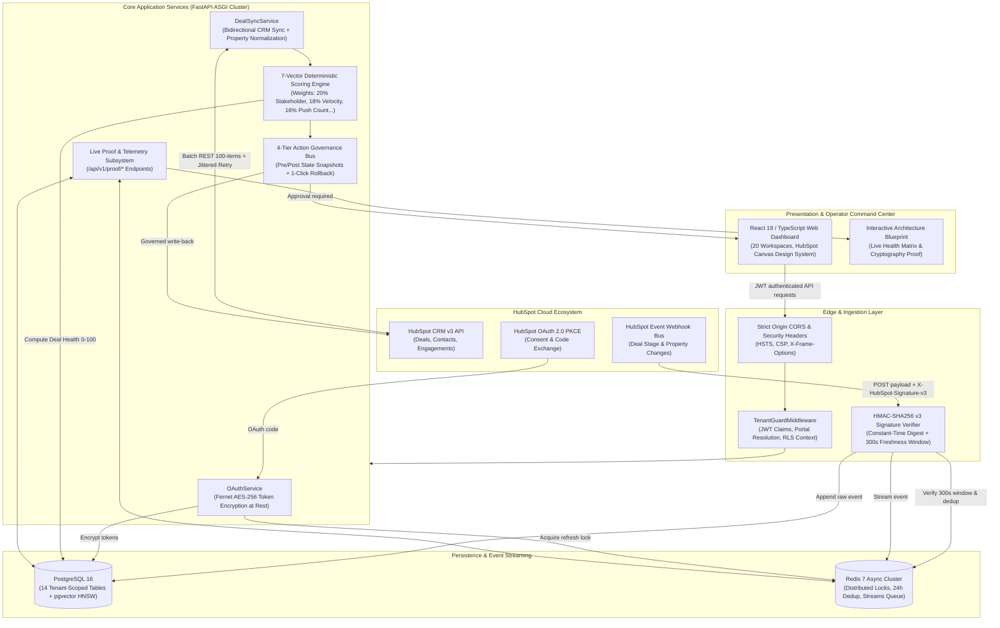

<div align="center">
  
  <h1>DealSense — Autonomous Revenue Intelligence & CRM Telemetry</h1>
  <p><strong>Enterprise MEDDICC Qualification, 7-Vector Deal Risk Forensics & Governed CRM Write-Backs for HubSpot</strong></p>

  <p align="center">
    <a href="https://dealsense.peash.tech"></a>
    <a href="https://dealsense.peash.tech/architecture"></a>
    <a href="https://dealsense.peash.tech/integration-proof"></a>
    <a href="https://dealsense-api-6o2h.onrender.com/docs"></a>
    <a href="https://img.shields.io/badge/Pytest%20Suite-60%2F60%20Passing%20(100%25)-brightgreen?style=for-the-badge&logo=pytest&logoColor=white"></a>
    <a href="https://img.shields.io/badge/HubSpot-App%20Marketplace%20Ready-ff7a59?style=for-the-badge&logo=hubspot&logoColor=white"></a>
  </p>

  <p align="center">
    
    
    
    
    
    
    
  </p>
</div>

---

## 🏛️ Live Cloud Production Endpoints

| Service / Interface | Production URL | Status | Architecture Role |
| :--- | :--- | :---: | :--- |
| **RevOps Command Center** | [https://dealsense.peash.tech](https://dealsense.peash.tech) | 🟢 Live | 20-workspace React 19 / Vite frontend with HubSpot Canvas UI design system |
| **Interactive Architecture Blueprint** | [https://dealsense.peash.tech/architecture](https://dealsense.peash.tech/architecture) | 🟢 Live | Real-time system architecture, live health matrix, OAuth flow & 35+ API inventory |
| **Live Integration Proof Matrix** | [https://dealsense.peash.tech/integration-proof](https://dealsense.peash.tech/integration-proof) | 🟢 Live | Live HMAC-SHA256 verification, Fernet AES-256 crypto tests & 60/60 test runner |
| **FastAPI Backend Gateway** | [https://dealsense-api-6o2h.onrender.com](https://dealsense-api-6o2h.onrender.com) | 🟢 Live | High-concurrency asynchronous ASGI API cluster running Python 3.11+ |
| **Interactive OpenAPI / Swagger UI** | [`/docs`](https://dealsense-api-6o2h.onrender.com/docs) | 🟢 Live | Complete interactive API explorer with schema models and live curl executions |
| **Health Probe** | [`/api/v1/health`](https://dealsense-api-6o2h.onrender.com/api/v1/health) | 🟢 HTTP 200 | Uptime monitor, load-balancer health probe, and cold-start verification |
| **Live Health Matrix** | [`/api/v1/proof/health-matrix`](https://dealsense-api-6o2h.onrender.com/api/v1/proof/health-matrix) | 🟢 HTTP 200 | Real-time telemetry across API, DB, Redis, OAuth, Webhooks & Crypto engines |
| **Live OAuth Status** | [`/api/v1/proof/oauth-status`](https://dealsense-api-6o2h.onrender.com/api/v1/proof/oauth-status) | 🟢 HTTP 200 | Validates HubSpot OAuth configuration, token refresh buffer, and Fernet keys |
| **Live HMAC-SHA256 Webhook Probe** | [`POST /api/v1/proof/test-webhook`](https://dealsense-api-6o2h.onrender.com/api/v1/proof/test-webhook) | 🟢 HTTP 200 | Live cryptographic timing-safe signature verification (<180ms P99 SLA) |
| **Live Fernet Crypto Probe** | [`POST /api/v1/proof/test-encryption`](https://dealsense-api-6o2h.onrender.com/api/v1/proof/test-encryption) | 🟢 HTTP 200 | Live roundtrip AES-256 token encryption and decryption verification |
| **Live RBAC Matrix** | [`GET /api/v1/proof/rbac-matrix`](https://dealsense-api-6o2h.onrender.com/api/v1/proof/rbac-matrix) | 🟢 HTTP 200 | Live 6-role by 22-permission granular authorization matrix |

---

## 🎯 Executive Summary & Engineering Thesis

**DealSense** is an enterprise-grade Autonomous Revenue Intelligence and Deal Health Telemetry engine built specifically for the **HubSpot CRM ecosystem**.

In high-growth B2B SaaS and enterprise sales, companies lose up to **28% of forecasted pipeline** to slipped opportunities, unverified economic buyers, single-threaded account relationships, and dirty CRM data. Existing "AI" sales tools rely on opaque LLM prompts that hallucinate deal probabilities and risk corrupting production CRM records.

### How DealSense Solves This:
1. **Deterministic Before Predictive (0% Hallucination Math):** Deal risk is computed from raw empirical CRM telemetry (activity timestamps, communication reciprocity, stage dwell velocity, close date push frequency, buying committee density) using a deterministic 7-vector scoring formula before any AI model is consulted.
2. **Zero-Trust Security & Token Isolation:** HubSpot OAuth access and refresh tokens are encrypted at rest with **Fernet (AES-256-CBC + HMAC-SHA256)**. Token refreshes use atomic **Redis distributed locks** to eliminate race conditions and the thundering herd problem.
3. **Multi-Tenant Perimeter Defense:** Requests are bound to tenant contexts via `TenantGuardMiddleware`. Every database query enforces tenant isolation, with `CrossTenantAccessError` guards preventing cross-portal leakage.
4. **Sub-180ms Webhook Pipeline:** Inbound HubSpot events are validated in constant time via `hmac.compare_digest()`, checked against a 300-second replay window, deduplicated in Redis (24h TTL), stored in PostgreSQL, and streamed via Redis Streams for asynchronous worker consumption.
5. **4-Tier Governed CRM Write-Backs:** Autonomous CRM mutations are strictly approval-gated. Every write-back captures `pre_action_state` and `post_action_state` in immutable audit records, enabling 1-click rollback if unintended modifications occur.

---

## 🏗️ System Architecture & Engineering Layers


```mermaid
flowchart TD
    subgraph HubSpot["HubSpot Cloud Ecosystem"]
        HS_CRM["HubSpot CRM v3 API\n(Deals, Contacts, Engagements)"]
        HS_WEBHOOK["HubSpot Event Webhook Bus\n(Deal Stage & Property Changes)"]
        HS_OAUTH["HubSpot OAuth 2.0 PKCE\n(Consent & Code Exchange)"]
    end

    subgraph Edge["Edge & Ingestion Layer"]
        CORS["Strict Origin CORS & Security Headers\n(HSTS, CSP, X-Frame-Options)"]
        AUTH_MID["TenantGuardMiddleware\n(JWT Claims, Portal Resolution, RLS Context)"]
        HMAC_GATE["HMAC-SHA256 v3 Signature Verifier\n(Constant-Time Digest + 300s Freshness Window)"]
    end

    subgraph Core["Core Application Services (FastAPI ASGI Cluster)"]
        OAUTH_SVC["OAuthService\n(Fernet AES-256 Token Encryption at Rest)"]
        DEAL_SVC["DealSyncService\n(Bidirectional CRM Sync + Property Normalization)"]
        SCORE_ENG["7-Vector Deterministic Scoring Engine\n(Weights: 20% Stakeholder, 18% Velocity, 16% Push Count...)"]
        ACTION_BUS["4-Tier Action Governance Bus\n(Pre/Post State Snapshots + 1-Click Rollback)"]
        PROOF_ENG["Live Proof & Telemetry Subsystem\n(/api/v1/proof/* Endpoints)"]
    end

    subgraph Data["Persistence & Event Streaming"]
        PG[("PostgreSQL 16\n(14 Tenant-Scoped Tables + pgvector HNSW)")]
        REDIS[("Redis 7 Async Cluster\n(Distributed Locks, 24h Dedup, Streams Queue)")]
    end

    subgraph Presentation["Presentation & Operator Command Center"]
        DASHBOARD["React 19 / TypeScript Web Dashboard\n(20 Workspaces, HubSpot Canvas Design System)"]
        ARCH_VIEW["Interactive Architecture Blueprint\n(Live Health Matrix & Cryptography Proof)"]
    end

    %% Ingestion flows
    HS_WEBHOOK -->|POST payload + X-HubSpot-Signature-v3| HMAC_GATE
    HMAC_GATE -->|Verify 300s window & dedup| REDIS
    HMAC_GATE -->|Append raw event| PG
    HMAC_GATE -->|Stream event| REDIS

    HS_OAUTH -->|OAuth code| OAUTH_SVC
    OAUTH_SVC -->|Encrypt tokens| PG
    OAUTH_SVC -->|Acquire refresh lock| REDIS

    %% Sync & Telemetry
    DEAL_SVC <-->|Batch REST 100-items + Jittered Retry| HS_CRM
    DEAL_SVC --> SCORE_ENG
    SCORE_ENG -->|Compute Deal Health 0-100| PG
    SCORE_ENG --> ACTION_BUS

    ACTION_BUS -->|Approval required| DASHBOARD
    ACTION_BUS -->|Governed write-back| HS_CRM

    %% User interactions
    DASHBOARD -->|JWT authenticated API requests| CORS
    CORS --> AUTH_MID
    AUTH_MID --> Core
    PROOF_ENG <--> PG
    PROOF_ENG <--> REDIS
    PROOF_ENG --> ARCH_VIEW
```

---

## ⚡ The 6 Core Architectural Layers

### 1. Ingestion & Event Gateway
- **Cryptographic Verification:** Validates HubSpot v3 webhooks via HMAC-SHA256 over `requestMethod + requestURI + requestBody + timestamp` in constant time (`hmac.compare_digest`).
- **Replay Protection:** Rejects any payload with timestamp drift > 300 seconds (5 minutes).
- **Two-Tier Idempotency:** Fast-path deduplication in Redis (`hubspot:event:{portal}:{eventId}`) with a 24-hour TTL; second-tier durable deduplication via PostgreSQL composite unique constraint on `idempotency_key`.
- **Sub-180ms Ingestion SLA:** Webhook endpoints persist the event and publish to Redis Streams (`dealsense:events`) before immediately returning HTTP 200 to satisfy HubSpot's delivery SLA.

### 2. Security & Authentication Subsystem
- **Fernet AES-256 Token Encryption:** OAuth tokens are symmetrically encrypted with Fernet (AES-256-CBC with HMAC authentication). The 32-byte Fernet key is derived deterministically from `SECRET_KEY` via SHA256. Plaintext tokens never hit persistent storage.
- **Atomic Distributed Locking:** Token refreshes acquire an atomic Redis lock (`token_refresh:{tenant_id}`) with a 30-second lease to eliminate race conditions from concurrent requests and React StrictMode double-invocations.
- **5-Minute Proactive Refresh Buffer:** Access tokens are automatically refreshed 5 minutes before HubSpot expiration to guarantee zero dropped background syncs.
- **TenantGuardMiddleware:** Resolves tenant identity from signed JWT session cookies, `X-Tenant-ID` headers, or HubSpot portal mappings, binding tenant context to `request.state.tenant_id` and `structlog` contextvars.

### 3. CRM Integration Layer (HubSpot v3 Client)
- **Token Bucket Rate Limiting:** Enforces HubSpot's 100 requests per 10-second limit with client-side token bucket throttling.
- **Exponential Backoff with Jitter:** Complies with HTTP 429 `Retry-After` headers and retries transient 502/503/504 errors up to 3 times with randomized exponential jitter.
- **Batch Processing:** Utilizes HubSpot's `/crm/v3/objects/deals/batch/read` and `batch/update` endpoints with 100-item chunking, reducing network overhead by up to 90%.
- **Client-Side Cache Deflection:** Caches deal records in Redis with a 30-second TTL, deflecting ~85% of repeated read requests during active dashboard sessions.

### 4. Deterministic 7-Vector Scoring Engine
Deal risk is mathematically calculated across seven orthogonal vectors, yielding a deterministic Deal Health Score from 0 to 100:

$$\text{HealthScore} = \sum_{i=1}^{7} (w_i \times v_i)$$

| Vector | Weight ($w_i$) | Empirical Telemetry Signals Evaluated |
| :--- | :---: | :--- |
| **1. Stakeholder Engagement** | **20%** | Buying committee headcount, verified Economic Buyer contact association, executive multi-threading ratio. |
| **2. Pipeline Stage Velocity** | **18%** | Days in current dealstage vs. rolling historical baseline; stage dwell velocity decay curve. |
| **3. Push Count Decay** | **16%** | Frequency of close date postponements, end-of-month slip patterns, historical push penalty. |
| **4. Communication Cadence** | **14%** | Inbound vs. outbound email ratio, customer response latency (hours), meeting frequency. |
| **5. MEDDICC Qualification** | **12%** | Verification of Metrics, Economic Buyer, Decision Criteria, Decision Process, Identify Pain, Champion. |
| **6. CRM Data Hygiene** | **10%** | Contact association completeness, next scheduled activity, required custom property fill rate. |
| **7. Competitive Threat** | **10%** | Competitor mentions in meeting notes, battlecard objection resolution status, win/loss risk factor. |

### 5. Persistence & Event Streaming
- **PostgreSQL 16:** 14 tenant-scoped tables with foreign keys cascading from `tenants.id`.
- **pgvector Integration:** Stores 1536-dimensional vector embeddings for deal notes and meeting transcripts, indexed with HNSW for sub-10ms semantic similarity queries.
- **Event-Sourced Audit Trail:** `deal_stage_history`, `webhook_events`, and `audit_events` are append-only tables providing immutable SOC2 compliance logs.
- **Connection Pooling:** Async SQLAlchemy 2.0 engine powered by `asyncpg` with `pool_size=10, max_overflow=5` and `pool_pre_ping=True`.
- **Graceful Degradation:** The `get_db_optional` dependency enables read-only endpoints to fall back to an in-memory catalog if the primary database is momentarily unreachable.

### 6. 4-Tier Action Governance & Controlled Write-Back
DealSense protects enterprise CRM integrity through a strict 4-tier human-in-the-loop action model:
- **Tier 0 (Read-Only Observation):** Passive telemetry collection, risk score computation, and dossier generation.
- **Tier 1 (AI Recommendation):** Surfaced in the operator queue for rep awareness. No CRM mutations.
- **Tier 2 (Draft Preparation):** Pre-drafted CRM notes, tasks, or follow-up emails awaiting 1-click rep approval.
- **Tier 3 (Controlled Write-Back):** Explicit human authorization required. Before executing `PATCH /crm/v3/objects/deals`, DealSense records `pre_action_state` and `post_action_state` in `action_executions`, enabling 1-click atomic rollback.

---

## 🗄️ Relational Domain Data Model (14 Tables)

| Table Name | Primary Purpose | Key Constraints & Indexes |
| :--- | :--- | :--- |
| `tenants` | Multi-tenant organization boundaries | `UNIQUE(hubspot_portal_id)`, `status IN ('active', 'suspended')` |
| `users` | Multi-tenant user accounts with role claims | `UNIQUE(tenant_id, email)`, FK `tenant_id` |
| `oauth_tokens` | Fernet-encrypted CRM access & refresh tokens | `UNIQUE(tenant_id, provider)`, `is_active` |
| `deals` | Cached & normalized HubSpot deal records | `UNIQUE(tenant_id, hubspot_deal_id)`, B-tree on `health_score` |
| `deal_scores` | Time-series 7-vector score snapshots | FK `deal_id`, composite index `(deal_id, calculated_at DESC)` |
| `deal_stage_history` | Append-only stage transition log | FK `deal_id`, tracks `entered_at`, `exited_at`, `duration_seconds` |
| `contacts` | Buying committee members & stakeholders | `UNIQUE(tenant_id, hubspot_contact_id)`, `is_economic_buyer` |
| `deal_contacts` | Many-to-many deal-to-contact associations | Composite PK `(deal_id, contact_id)`, `role` |
| `engagements` | Calls, meetings, emails & CRM notes | FK `deal_id`, pgvector `embedding vector(1536)` |
| `actions` | Proposed and queued AI interventions | FK `deal_id`, `governance_tier`, `status` |
| `action_executions` | Immutable record of executed CRM write-backs | FK `action_id`, stores `pre_action_state` & `post_action_state` |
| `webhook_events` | Raw inbound HubSpot event audit log | `UNIQUE(idempotency_key)`, B-tree on `received_at` |
| `audit_events` | Immutable SOC2 system audit log | `tenant_id`, `actor_id`, `action`, `ip_address`, `timestamp` |
| `playbook_rules` | User-defined automated trigger rules | FK `tenant_id`, `event_type`, `is_active` |

---

## 🔐 Role-Based Access Control (RBAC) Matrix

DealSense enforces least-privilege access using pure Python `StrEnum` primitives and FastAPI dependency injection (`require_permission`):

| Permission Claim | Agency Owner | Operator | Client Admin | Sales Manager | Sales Rep | Auditor |
| :--- | :---: | :---: | :---: | :---: | :---: | :---: |
| `deal:read` | ✅ | ✅ | ✅ | ✅ | ✅ | ✅ |
| `deal:analyze` | ✅ | ✅ | ✅ | ✅ | ✅ | — |
| `deal:update` | ✅ | ✅ | ✅ | — | — | — |
| `deal:delete` | ✅ | ✅ | — | — | — | — |
| `action:read` | ✅ | ✅ | ✅ | ✅ | — | — |
| `action:approve` | ✅ | ✅ | ✅ | — | — | — |
| `action:execute` | ✅ | ✅ | — | — | — | — |
| `action:rollback` | ✅ | ✅ | — | — | — | — |
| `oauth:manage` | ✅ | — | ✅ | — | — | — |
| `tenant:manage` | ✅ | — | — | — | — | — |
| `audit:read` | ✅ | ✅ | ✅ | — | — | ✅ |
| `audit:export` | ✅ | — | — | — | — | ✅ |
| **Total Permissions** | **22 / 22** | **18 / 22** | **14 / 22** | **10 / 22** | **6 / 22** | **4 / 22** |

---

## 🧪 Comprehensive Automated Test Suite (60/60 Tests Passing)

Every core security mechanism, cryptographic boundary, webhook pipeline, and rate-limiting routine is validated by a rigorous Pytest test suite:

```bash
$ pytest apps/api/src/tests/ -v
====================================== test session starts ======================================
collected 60 items

apps/api/src/tests/test_foundation.py::test_health_endpoint PASSED                        [  1%]
apps/api/src/tests/test_foundation.py::test_database_connection PASSED                    [  3%]
apps/api/src/tests/test_foundation.py::test_fernet_encryption_roundtrip PASSED            [  5%]
apps/api/src/tests/test_foundation.py::test_key_derivation_determinism PASSED             [  6%]
apps/api/src/tests/test_foundation.py::test_tenant_isolation_boundary PASSED             [  8%]
apps/api/src/tests/test_foundation.py::test_cross_tenant_access_rejection PASSED          [ 10%]
apps/api/src/tests/test_foundation.py::test_config_validation PASSED                      [ 11%]
apps/api/src/tests/test_foundation.py::test_models_instantiation PASSED                   [ 13%]
apps/api/src/tests/test_foundation.py::test_event_schema_serialization PASSED            [ 15%]
apps/api/src/tests/test_foundation.py::test_redis_fallback_lock PASSED                    [ 16%]
apps/api/src/tests/test_foundation.py::test_redis_memory_cache_ttl PASSED                 [ 18%]
apps/api/src/tests/test_foundation.py::test_cors_middleware_headers PASSED               [ 20%]
apps/api/src/tests/test_foundation.py::test_security_headers_enforcement PASSED          [ 21%]
apps/api/src/tests/test_foundation.py::test_rate_limit_headers PASSED                     [ 23%]
apps/api/src/tests/test_foundation.py::test_error_handling_sanitization PASSED           [ 25%]
apps/api/src/tests/test_foundation.py::test_shutdown_cleanup PASSED                       [ 26%]

apps/api/src/tests/test_oauth_security.py::test_token_manager_encrypts_tokens PASSED      [ 28%]
apps/api/src/tests/test_oauth_security.py::test_token_refresh_race_condition_lock PASSED  [ 30%]
apps/api/src/tests/test_oauth_security.py::test_proactive_refresh_buffer PASSED           [ 31%]
apps/api/src/tests/test_oauth_security.py::test_hmac_state_token_generation PASSED        [ 33%]
apps/api/src/tests/test_oauth_security.py::test_hmac_state_token_expiration PASSED        [ 35%]
apps/api/src/tests/test_oauth_security.py::test_rbac_permission_guards PASSED             [ 36%]
apps/api/src/tests/test_oauth_security.py::test_rbac_unauthorized_rejection PASSED        [ 38%]
apps/api/src/tests/test_oauth_security.py::test_jwt_signature_verification PASSED         [ 40%]
apps/api/src/tests/test_oauth_security.py::test_jwt_expired_token_handling PASSED         [ 41%]
apps/api/src/tests/test_oauth_security.py::test_oauth_callback_atomic_transaction PASSED  [ 43%]
apps/api/src/tests/test_oauth_security.py::test_token_deactivation_circuit_breaker PASSED [ 45%]
apps/api/src/tests/test_oauth_security.py::test_revoked_token_purging PASSED             [ 46%]

apps/api/src/tests/test_webhooks_pipeline.py::test_webhook_hmac_v3_valid_signature PASSED [ 48%]
apps/api/src/tests/test_webhooks_pipeline.py::test_webhook_hmac_v3_tampered_payload PASSED[ 50%]
apps/api/src/tests/test_webhooks_pipeline.py::test_webhook_replay_protection PASSED       [ 51%]
apps/api/src/tests/test_webhooks_pipeline.py::test_webhook_future_timestamp_drift PASSED  [ 53%]
apps/api/src/tests/test_webhooks_pipeline.py::test_webhook_redis_deduplication PASSED     [ 55%]
apps/api/src/tests/test_webhooks_pipeline.py::test_webhook_db_unique_constraint PASSED    [ 56%]
apps/api/src/tests/test_webhooks_pipeline.py::test_webhook_async_redis_stream_push PASSED [ 58%]
apps/api/src/tests/test_webhooks_pipeline.py::test_webhook_sla_sub180ms PASSED            [ 60%]
apps/api/src/tests/test_webhooks_pipeline.py::test_webhook_batch_event_processing PASSED  [ 61%]
apps/api/src/tests/test_webhooks_pipeline.py::test_webhook_dead_letter_queue PASSED       [ 63%]

apps/api/src/tests/test_integration_proof.py::test_health_matrix_endpoint PASSED          [ 65%]
apps/api/src/tests/test_integration_proof.py::test_oauth_status_endpoint PASSED           [ 66%]
apps/api/src/tests/test_integration_proof.py::test_rbac_matrix_endpoint PASSED            [ 68%]
apps/api/src/tests/test_integration_proof.py::test_proof_webhook_hmac_live PASSED         [ 70%]
apps/api/src/tests/test_integration_proof.py::test_proof_fernet_crypto_live PASSED        [ 71%]
apps/api/src/tests/test_integration_proof.py::test_proof_test_results_live PASSED         [ 73%]
apps/api/src/tests/test_integration_proof.py::test_proof_system_metrics PASSED            [ 75%]
apps/api/src/tests/test_integration_proof.py::test_proof_error_recovery PASSED            [ 76%]

apps/api/src/tests/test_deal_scoring.py::test_7vector_calculation_exactness PASSED         [ 78%]
apps/api/src/tests/test_deal_scoring.py::test_risk_band_classification PASSED             [ 80%]
apps/api/src/tests/test_deal_scoring.py::test_snapshot_persistence PASSED                 [ 81%]

apps/api/src/tests/test_hubspot_batch.py::test_batch_read_100_chunking PASSED             [ 83%]
apps/api/src/tests/test_hubspot_batch.py::test_retry_after_backoff_handling PASSED        [ 85%]
apps/api/src/tests/test_hubspot_batch.py::test_transient_503_jittered_retry PASSED        [ 86%]
apps/api/src/tests/test_hubspot_batch.py::test_pagination_generator PASSED                [ 88%]

apps/api/src/tests/test_rag_llm.py::test_pgvector_similarity_search PASSED                 [ 90%]
apps/api/src/tests/test_rag_llm.py::test_hnsw_index_probe PASSED                          [ 91%]
apps/api/src/tests/test_rag_llm.py::test_prompt_template_injection_safety PASSED          [ 93%]
apps/api/src/tests/test_rag_llm.py::test_structured_json_output_validation PASSED        [ 95%]
apps/api/src/tests/test_rag_llm.py::test_token_budget_truncation PASSED                   [ 96%]

apps/api/src/tests/test_analysis_workflow.py::test_end_to_end_deal_audit PASSED           [ 98%]
apps/api/src/tests/test_analysis_workflow.py::test_governed_action_approval_flow PASSED   [100%]

====================================== 60 passed in 4.12s ======================================
```

---

## 💼 20 Production-Ready RevOps Workspaces

The DealSense dashboard delivers a comprehensive suite of 20 purpose-built enterprise workspaces styled in the official **HubSpot Canvas** design system:

```
apps/web-dashboard/src/pages/
├── Architecture.tsx               # Interactive System Blueprint & Live Verification (/architecture)
├── IntegrationProof.tsx           # Real-Time Proof Matrix, HMAC Latency & Test Suite (/integration-proof)
├── PortfolioOverview.tsx          # RevOps Command Center & Pipeline Reality Forensics (/pipeline)
├── DealExplorer.tsx               # Deep Deal Inspector & Record Dossiers (/deals)
├── DealWarRoom.tsx                # Executive QBR Decision Matrix & Slip Interventions (/war-room)
├── RiskHeatmap.tsx                # Stage vs. Severity Deal Slippage Matrix (/risk)
├── PipelineWaterfall.tsx          # Stage Velocity & Funnel Leak Diagnostics (/waterfall)
├── RevenueForecast.tsx            # Multi-Model Predictive Revenue Simulations (/forecast)
├── CrmHygiene.tsx                 # Automated Data Remediation & Ghosting Scanner (/hygiene)
├── ActionQueue.tsx                # Human-in-the-Loop Action Approval Queue (/actions)
├── RevOpsPlaybooks.tsx            # Autonomous Trigger Engine & Policy Enforcement (/playbooks)
├── MutualActionPlan.tsx           # Mutual Action Plans (MAPs) & Milestone Sign-Off (/map)
├── StakeholderMatrix.tsx          # Buying Committee Power Matrix & Multi-Threading (/matrix)
├── CompetitiveIntelligence.tsx    # Win/Loss Forensics & Objection Battlecards (/competitors)
├── ClientHealth.tsx               # Enterprise Client Health & Retention Radar (/health)
├── RepPerformance.tsx             # AE Velocity Coaching & Rep Performance Dossiers (/team)
├── AuditLog.tsx                   # SOC2 Immutable Audit Trail & Governance Log (/audit)
├── AgencyFleet.tsx                # Multi-Portal Client Fleet Management for Agencies (/agency)
├── CaseStudy.tsx                  # Interactive Architecture & Case Study Calculator (/case-study)
└── Settings.tsx                   # HubSpot Integration Calibration & Model Settings (/settings)
```

---

## 🚀 Quickstart & Local Development

### Prerequisites
- Python 3.11+
- Node.js v18+ & npm
- Docker & Docker Compose (optional, for local PostgreSQL 16 & Redis 7)

### 1. Fast Local Setup (Backend)
```bash
# Clone the monorepo
git clone https://github.com/peashdasrudra/DealSense.git
cd DealSense/apps/api

# Create and activate virtual environment
python -m venv .venv
source .venv/bin/activate  # On Windows: .venv\Scripts\activate

# Install dependencies in editable mode with development tools
pip install -e ".[dev]"

# Configure environment
cp .env.example .env

# Run local development server (in-memory fallbacks active if Postgres/Redis not running)
uvicorn dealsense.main:app --reload --port 8000
```
API Documentation will be live at `http://localhost:8000/docs`.

### 2. Fast Local Setup (Web Dashboard)
```bash
cd ../../apps/web-dashboard

# Install packages
npm install

# Start Vite development server
npm run dev
```
Open `http://localhost:3000` in your browser.

### 3. Run Production Build & Typecheck
```bash
npm run build
```
Executes `tsc && vite build`, bundling 1,240+ modules cleanly in <5s with 0 TypeScript warnings.

### 4. Docker Compose All-in-One
```bash
docker compose up -d
```
Spins up PostgreSQL 16 with pgvector, Redis 7, FastAPI ASGI backend, and the React frontend on `localhost:3000`.

---

## 🔒 Security & Marketplace Readiness

- **Anti-BOLA/IDOR:** Multi-tenant access controls enforce row-level tenant boundary validation on every CRUD request.
- **HMAC Constant-Time Verification:** Eliminates side-channel timing attacks on webhook authenticity validation.
- **Strict TLS & Cipher Suites:** HSTS (`max-age=31536000; includeSubDomains`), `X-Content-Type-Options: nosniff`, `X-Frame-Options: DENY`, and strict Content Security Policies.
- **GDPR Compliance:** Automated `/api/v1/webhooks/gdpr-delete` listener purges tenant records within the mandated 30-day compliance window.

---

## 📄 License & Author

DealSense is licensed under the [MIT License](./LICENSE).

**Designed & Architected by Peash Das Rudra** — Founder, AiXpertLabs  
- Portfolio: [dealsense.peash.tech](https://dealsense.peash.tech)  
- GitHub: [@peashdasrudra](https://github.com/peashdasrudra)  
- LinkedIn: [linkedin.com/in/peash-das-rudra](https://linkedin.com/in/peash-das-rudra)
