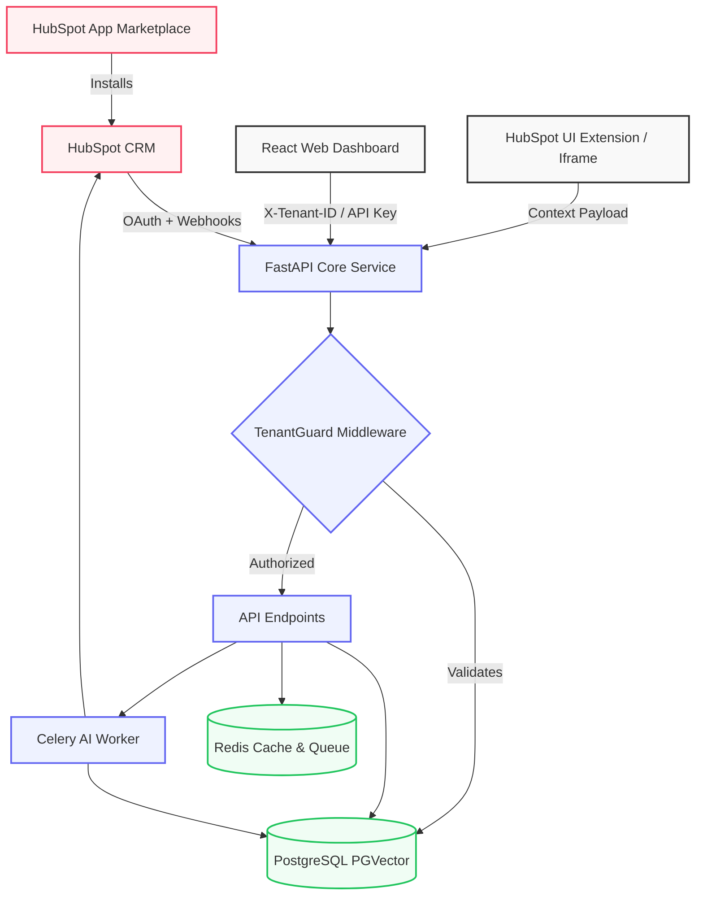

# Architecture 

DealSense is built as an enterprise-grade multi-tenant architecture designed specifically for the HubSpot Marketplace. It separates the core intelligence API from the presentation layers (Web Dashboard and HubSpot Native App).

## System Components

### 1. Presentation Layer
- **Web Dashboard (React + Vite):** A standalone, glassmorphic UI built for single-server admins and prospects (via Demo Mock mode). It dynamically queries the API based on the authenticated `Tenant ID`.
- **HubSpot Native UI Extension:** A React-based UI Extension that lives inside the HubSpot CRM Deal sidebar, fetching localized intelligence from the DealSense API.

### 2. Core API (FastAPI)
The central nervous system, built in asynchronous Python (FastAPI). 
- **Multi-Tenancy:** Handled strictly via the `TenantGuardMiddleware`, isolating data at the row level via `tenant_id`.
- **Demo Mode:** When accessed without authentication, the API gracefully falls back to an in-memory mock state, enabling prospects to test the UI without an active CRM connection.

### 3. Asynchronous Workers
Complex deal scoring, MEDDICC analysis, and signal extraction are offloaded to Celery workers using Redis as a message broker.

### 4. Data Layer
- **PostgreSQL (PGVector):** Stores Tenant configurations, OAuth tokens, Deal Snapshots, and embeddings for RAG-based intelligence.
- **Redis:** Provides high-speed caching for API endpoints and manages background task queues.

## Authentication Flows

DealSense employs a dual-mode authentication strategy to support both Marketplace isolation and standalone operations:

1. **Marketplace Flow (OAuth 2.0):** When a user installs the app from the HubSpot Marketplace, DealSense initiates an OAuth flow, securely storing the access/refresh tokens mapped to their unique `tenant_id`.
2. **Single Server Flow (Manual API Key):** The dashboard bypasses OAuth by supplying an Admin API Key, which the backend honors and maps to the primary operational tenant.
