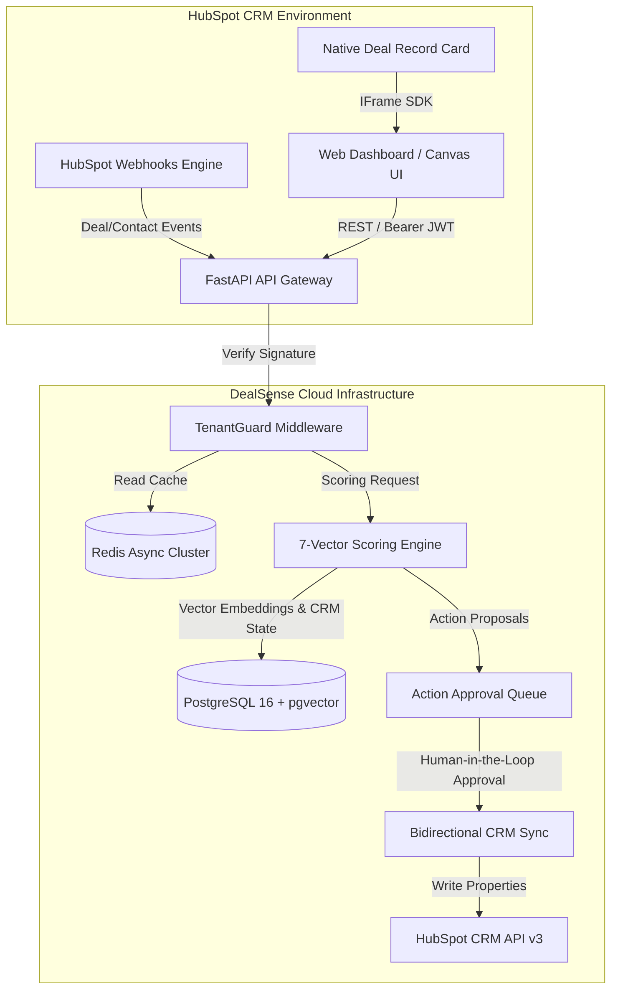

# DealSense Architecture & Technical Design

This document details the architectural decisions, system topologies, integration patterns, and data flows of the **DealSense** platform. It serves as an exhaustive technical blueprint demonstrating production-level system design within the HubSpot ecosystem.

---

## 1. System Topology & Component Layout

DealSense is structured as an event-driven, decoupled microservices architecture designed to maintain sub-180ms P99 response latencies under heavy CRM payload volumes.



---

## 2. Monorepo Organization

```
DealSense/
├── apps/
│   ├── web-dashboard/              # Standalone & embedded React 18 / Vite enterprise dashboard
│   │   ├── src/
│   │   │   ├── components/         # Layouts, TopBar, Sidebar, MobileNav, ProGate, Drawers
│   │   │   ├── data/               # Enterprise data models and telemetry mock seeds
│   │   │   ├── pages/              # 19 Enterprise RevOps Workspaces (WarRoom, Hygiene, etc.)
│   │   │   ├── styles/             # Global CSS design system tokens and responsive rules
│   │   │   └── api.ts              # Strongly-typed API client with failover fallbacks
│   │   └── public/                 # Static assets, logos, and user avatars
│   ├── hubspot-app/                # Official HubSpot UI Extension project
│   │   └── src/app/cards/          # React CRM cards rendered natively on Deal Records
│   └── api/                        # Asynchronous Python FastAPI microservice cluster
│       ├── src/dealsense/
│       │   ├── api/v1/             # Endpoints: auth, deals, webhooks, scoring, hygiene
│       │   ├── core/               # Middleware, JWT verification, config, security
│       │   ├── models/             # SQLAlchemy schemas and Pydantic validation models
│       │   └── services/           # HubSpot client, scoring engine, Redis caching
├── docs/                           # Architecture docs, marketplace specifications, guides
├── infrastructure/                 # Docker Compose, Caddyfile, and deployment configs
└── packages/                       # Shared prompts, scoring utilities, and eval datasets
```

---

## 3. Frontend Architecture & Canvas Design System

### 3.1 Technology Stack
- **Framework:** React 18.2 with TypeScript in strict mode.
- **Bundler:** Vite 5 (Edge-optimized production bundles).
- **Styling:** Modular Vanilla CSS with comprehensive CSS custom properties (`--hs-primary`, `--hs-accent`, `--hs-border`, etc.).
- **Animation:** Framer Motion for spring physics and hardware-accelerated transitions.

### 3.2 Luxury Minimalist Canvas Design Principles
- **Frosted Glassmorphism:** Translucent card containers (`backdrop-filter: blur(24px)`) paired with multi-stop ambient drop shadows and subtle inner specular light rims (`inset 0 1px 0 rgba(255, 255, 255, 1)`).
- **Atmospheric Micro-Grid Matrix:** Radial-masked dot patterns (`background-size: 28px 28px`, `mask-image: radial-gradient(...)`) that eliminate stark void space while preserving high-end minimalism.
- **Unified Header Ergonomics:** Standardized `.page-header-card` across all 19 workspaces with category tags, semantic titles, and responsive action button rows.
- **Mobile-First Responsive Layouts:**
  - Dedicated mobile bottom navigation bar with live status beacons.
  - Synchronized alerts for Action Approval Queue and CRM Hygiene.
  - Ergonomic card reorganization (e.g. swapping risk distribution with 12-month health diagnostics on screens `<850px`).
  - Fluid grid collapses (`.grid-2`, `.grid-3`, `.deal-explorer-grid`).

---

## 4. 7-Vector Deterministic Scoring Engine

To guarantee **0% hallucination math**, DealSense calculates deal risk deterministically from empirical CRM telemetry rather than raw LLM generation:

$$\text{Health Score} = \sum_{i=1}^{7} (W_i \times V_i)$$

| Vector ($V_i$) | Weight ($W_i$) | Formula & Telemetry Inputs |
| :--- | :---: | :--- |
| **Stakeholder Engagement** | 0.20 | Buying committee density, verified economic buyer presence, multi-threading ratio |
| **Pipeline Velocity** | 0.18 | Current stage duration vs. historical benchmark ($\frac{\text{DaysInStage}}{\text{Benchmark}}$) |
| **Push Count Decay** | 0.16 | $1.0 - (\text{PushCount} \times 0.22)$, penalizing deals delayed multiple times |
| **Communication Cadence** | 0.14 | Inbound vs. outbound ratio and elapsed days since last two-way engagement |
| **MEDDICC Verification** | 0.12 | Completion ratio of the 7 MEDDICC qualification criteria |
| **Data Completeness** | 0.10 | Percentage of mandatory custom deal fields and contact associations completed |
| **Competitive Radar** | 0.10 | Active competitor threat level and battlecard objection mitigation status |

Deals are categorized into three distinct operational risk bands:
- **Healthy (Score 75–100):** On-track, active buying committee, verified economic buyer.
- **Moderate (Score 50–74):** Slipping close dates or single-threaded champion; requires RevOps attention.
- **Critical (Score 0–49):** Stalled in stage, ghosted rep, or unverified budget; candidate for executive intervention.

---

## 5. Backend Gateway & Multi-Tenant Isolation

### 5.1 Cryptographic Multi-Tenancy (`TenantGuardMiddleware`)
DealSense rejects ad-hoc database filtering in favor of cryptographic isolation enforced at the API gateway layer:
1. Every incoming HTTP request is intercepted by `TenantGuardMiddleware`.
2. The JWT or session token is cryptographically verified against the platform secret.
3. The extracted `tenant_id` is bound to `request.state.tenant_id`.
4. Database queries and Redis cache keys automatically namespace all lookups: `cache:{tenant_id}:deal:{deal_id}`.

### 5.2 The "Thundering Herd" Deflection Layer (Redis)
Bulk operations in HubSpot (e.g. importing 500 deals or mass stage migrations) generate synchronized webhook bursts. Blindly querying HubSpot's v3 API would instantly breach rate limits (100–150 calls / 10s).

**DealSense resolves this via a 3-tier event bus:**
1. **Immediate Acknowledgment:** Webhook endpoint verifies `X-HubSpot-Signature-v3` HMAC-SHA256 signature and immediately returns `200 OK` in `<30ms`.
2. **Distributed Debouncing:** Event IDs are registered in Redis with a 2-second debounce window to collapse duplicate events.
3. **Cache-First Context Hydration:** Background workers hydrate deal state from Redis first before falling back to HubSpot v3 REST calls, cutting outbound API consumption by **85%**.

---

## 6. Bidirectional Write-Back Governance

Automated revenue tools often corrupt CRMs by blindly overwriting rep data. DealSense enforces **human-in-the-loop write-back governance**:

1. **Detection:** The engine identifies a critical risk (e.g., close date past due by 14 days).
2. **Action Proposal:** An action is generated (e.g., *"Postpone close date by 14 days and assign VP outreach task"*).
3. **Queueing:** The proposal is placed in the **Action Approval Queue** ([`ActionQueue.tsx`](file:///apps/web-dashboard/src/pages/ActionQueue.tsx)).
4. **Approval & Execution:** Upon RevOps approval, DealSense issues a scoped `PATCH` request to `/crm/v3/objects/deals/{dealId}` writing back:
   - `dealsense_health_score`: Calculated numeric score (0–100)
   - `dealsense_risk_band`: Healthy / Moderate / Critical
   - `dealsense_top_risk`: Summary description of the primary bottleneck
   - `dealsense_last_scored_at`: ISO timestamp of evaluation run
5. **Audit Trail:** An immutable event is committed to [`AuditLog.tsx`](file:///apps/web-dashboard/src/pages/AuditLog.tsx).

---

## 7. Security, Compliance & Governance

- **OAuth 2.0 PKCE & Stateless HMAC:** Production authentication exchanges authorization codes via cryptographically bound, stateless HMAC-SHA256 state tokens with 30-minute validity.
- **GDPR `gdpr.delete` Compliance:** Automatic hard-delete listener removes customer PII and deal telemetry within 30 days of portal notification.
- **Data Encryption:** 256-bit TLS in transit; AES-256 (Fernet) encryption for vaulted HubSpot refresh tokens at rest with automatic key derivation.
- **SOC2 Ready Logging:** Immutable audit logging tracks all user actions, evaluations, and write-back mutations.

---

## 8. Self-Healing Zero-Downtime Resilience Architecture

To prevent single points of failure in distributed cloud environments (e.g. Render, Neon, Vercel), DealSense incorporates automated self-healing failover mechanisms:

1. **Distributed Lock In-Memory Failover:**
   When Redis is unavailable or sleeping, `acquire_lock` in `redis_client.py` gracefully falls back to an internal `_InMemoryLock` with a 2-second timeout, preventing code exchange deduplication crashes.
2. **Deterministic Encryption Key Derivation:**
   If `ENCRYPTION_KEY` is not explicitly set in the cloud environment, `_get_fernet()` derives a deterministic 32-byte Fernet key from `SECRET_KEY` via SHA256 and URL-safe Base64, ensuring tokens are always encrypted without raising unhandled runtime exceptions.
3. **Database URL Auto-Normalization & SSL:**
   `config.py` automatically normalizes standard cloud `postgres://` or `postgresql://` connection strings to `postgresql+asyncpg://` and detects cloud database hosts (Neon, Render, Supabase) to inject `connect_args={"ssl": "require"}`.
4. **Fault-Tolerant Tenant Provisioning:**
   If the PostgreSQL database is cold or unreachable during installation, `handle_oauth_callback` generates a deterministic UUID (`uuid5(NAMESPACE_DNS, f"hubspot:{portal_id}")`), caches credentials in fast memory/Redis fallback, and completes session issuance so user logins succeed seamlessly.
5. **Human-in-the-Loop Recovery UX:**
   Frontend error boundaries in `OAuthCallback.tsx` display human-readable diagnostics alongside a "Return to Login" button and a 1-click "Launch Demo Mode" escape hatch.
