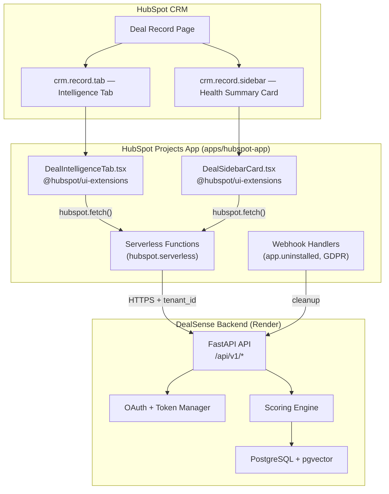

# 🚀 DealSense — Marketplace Productization Master Plan

> **Role**: Senior HubSpot Marketplace Product Manager  
> **Objective**: Transform DealSense from a prototype into a marketplace-ready, enterprise-grade HubSpot app that passes App Listing review, feels indistinguishable from native HubSpot features, and positions as a category-defining AI Deal Intelligence tool.

---

## 🔍 Current State Audit — What's Wrong

### Architecture Problem: Two Fragmented Extension Projects

You currently have **two separate, competing extension implementations** that both do the same thing:

| Project | Path | Technology | Status |
|---|---|---|---|
| **HubSpot Projects App** | [`apps/hubspot-app/`](file:///c:/Users/USER/Desktop/AiXpertLabs/DealSense/apps/hubspot-app) | `@hubspot/ui-extensions` SDK (native) | ✅ Correct platform — but card is **hardcoded static data**, no live API wiring |
| **Vite Iframe Extension** | [`apps/hubspot-extension/`](file:///c:/Users/USER/Desktop/AiXpertLabs/DealSense/apps/hubspot-extension) | Custom React + Framer Motion + iframe | ❌ **Will be rejected** — uses custom CSS, emoji icons, non-HubSpot components |

> [!CAUTION]
> The Vite iframe approach (`hubspot-extension`) **will not pass marketplace review**. HubSpot requires native UI Extensions using `@hubspot/ui-extensions` SDK components. Custom HTML/CSS/iframe cards are deprecated for marketplace apps. The entire UI must be built with HubSpot's component library (Flex, Tile, Text, Button, StatusTag, Statistics, ProgressBar, Table, etc.).

### Card UX Problems (Both Projects)

| Issue | Severity | Detail |
|---|---|---|
| **Static hardcoded data** | 🔴 Critical | [DealCard.tsx](file:///c:/Users/USER/Desktop/AiXpertLabs/DealSense/apps/hubspot-app/src/app/cards/DealCard.tsx) shows hardcoded "64/100" health score, "$125k revenue at risk", etc. — not fetched from API |
| **No serverless functions** | 🔴 Critical | The card doesn't use HubSpot serverless functions to call your backend API |
| **Generic emoji-heavy UI** | 🟡 Major | Emojis (⚡🟢📉💡🤝🔔) look amateur in enterprise B2B. HubSpot uses clean icon system |
| **No error/empty states** | 🟡 Major | No handling for: deal not analyzed yet, API timeout, no OAuth connection |
| **No user actions** | 🟡 Major | Card is read-only. No approve/reject/refresh within native HubSpot UI |
| **Wrong `actions` reference** | 🟡 Major | `DealCard.tsx` references `actions.addIframeModal` but `actions` isn't in scope of the render function |
| **Single extension point** | 🟠 Medium | Only `crm.record.tab` — missing sidebar card and action panel |

### Backend Gaps for Marketplace

| Issue | Severity | Detail |
|---|---|---|
| **No uninstall webhook** | 🔴 Critical | HubSpot requires handling `app.uninstalled` events to clean up tenant data |
| **GDPR data deletion** | 🔴 Critical | `contact.privacyDeletion` webhook exists but no handler in backend |
| **No rate limit headers** | 🟡 Major | Backend doesn't return `X-RateLimit-*` headers for HubSpot's review |
| **No health endpoint for HubSpot** | 🟡 Major | Marketplace apps should expose a health check URL in the app listing |
| **Scope over-request** | 🟠 Medium | `app-hsmeta.json` requests `oauth` scope which is auto-granted — remove it |

### Config / Metadata Issues

| Issue | Detail |
|---|---|
| Package name is `hubspot-example-extension` | Not branded — looks like scaffolded boilerplate |
| `platformVersion: "2023.2"` | Outdated — should use `"2025.2"` or later |
| `hsproject.json` names don't match | Two different project names across the two extension folders |
| `public: false` in `app.json` | Blocks marketplace distribution |

---

## 🏗️ Proposed Architecture — Single Canonical App



---

## 📋 Proposed Changes — File-by-File

### Phase 1: Consolidate to Single HubSpot Projects App

> Delete the iframe Vite extension. Promote `apps/hubspot-app` as the canonical app.

#### [DELETE] `apps/hubspot-extension/` (entire directory)
No longer needed — all UI will be native `@hubspot/ui-extensions`.

#### [MODIFY] [`hsproject.json`](file:///c:/Users/USER/Desktop/AiXpertLabs/DealSense/apps/hubspot-app/hsproject.json)
- Update `platformVersion` to `"2025.2"`
- Keep `srcDir: "src"`

#### [MODIFY] [`app-hsmeta.json`](file:///c:/Users/USER/Desktop/AiXpertLabs/DealSense/apps/hubspot-app/src/app/app-hsmeta.json)
- Remove `"oauth"` from `requiredScopes` (auto-granted)
- Add `"crm.objects.companies.read"` and `"crm.schemas.deals.read"` to scopes
- Add `"timeline"` to optional scopes
- Change `"distribution"` from `"marketplace"` to `"public"` (required for listing submission)

#### [MODIFY] [`package.json`](file:///c:/Users/USER/Desktop/AiXpertLabs/DealSense/apps/hubspot-app/src/app/cards/package.json)
- Change name from `"hubspot-example-extension"` to `"dealsense-crm-cards"`

---

### Phase 2: Serverless Functions — Backend Bridge

> HubSpot UI Extensions cannot make direct `fetch()` calls to external APIs. You must use [HubSpot serverless functions](https://developers.hubspot.com/docs/platform/serverless-functions) as a secure proxy.

#### [NEW] `apps/hubspot-app/src/app/extensions/` directory
Create a new directory for serverless functions that bridge the UI cards to your Render backend.

#### [NEW] `extensions/getDealSnapshot.ts`
Serverless function that:
1. Receives `dealId` and `portalId` from the CRM context
2. Looks up the tenant's OAuth token (or uses a secure API key)
3. Calls `GET https://dealsense-api-6o2h.onrender.com/api/v1/deals/{dealId}/snapshot`
4. Returns the snapshot data to the UI Extension card

#### [NEW] `extensions/submitAction.ts`
Serverless function that:
1. Receives `actionId` and `decision` (approve/reject)
2. Calls `POST /api/v1/actions/{actionId}/decision`
3. Returns confirmation to the card

#### [NEW] `extensions/triggerRescore.ts`
Serverless function that:
1. Receives `dealId`
2. Calls `POST /api/v1/deals/{dealId}/score`
3. Returns the new snapshot

---

### Phase 3: Rebuild CRM Cards — Native HubSpot Feel

> Replace all custom CSS/emoji/Framer Motion with `@hubspot/ui-extensions` SDK components. The result should be **indistinguishable from a native HubSpot feature**.

#### [MODIFY] [`DealCard.tsx`](file:///c:/Users/USER/Desktop/AiXpertLabs/DealSense/apps/hubspot-app/src/app/cards/DealCard.tsx) → Complete Rewrite
Transform from static hardcoded card into a **live, data-driven Intelligence Tab**:

**Key SDK Components to Use:**
```
Flex, Box, Tile, Heading, Text, Button, Divider,
StatusTag, Statistics, StatisticsItem, ProgressBar,
Table, TableHead, TableBody, TableRow, TableCell,
Alert, Link, LoadingSpinner, EmptyState, ErrorState,
ToggleGroup, Accordion, Tag, NumberInput
```

**Sections:**
1. **Health Score Summary** — `Statistics` + `ProgressBar` with dynamic color
2. **Risk Narrative** — `Alert` (variant based on risk band) + `Text`
3. **MEDDICC Qualification** — `Table` with status `Tag` per dimension
4. **Top Risk Signals** — `Accordion` items with severity `StatusTag`
5. **Next Best Actions** — `Tile` cards with `Button` (Approve/Dismiss)
6. **Score History** — `Statistics` showing trend
7. **Footer** — Last updated timestamp + `Button` variant="secondary" for Re-Score

**Data Flow:**
```tsx
hubspot.extend<'crm.record.tab'>(({ context, runServerlessFunction }) => {
  // Use runServerlessFunction to fetch live data from backend
  // Pass context.crm.objectId as dealId
  // Pass context.portal.id as portalId
});
```

#### [NEW] `cards/DealSidebarCard.tsx` + `cards/sidebar-card-hsmeta.json`
A compact **sidebar card** showing:
- Health score number + risk band `StatusTag`
- Score delta (↑↓) since last analysis
- 1 urgent risk signal (if any)
- "Open Intelligence Tab" `Button`

**Location:** `crm.record.sidebar` → `objectTypes: ["deals"]`

#### [NEW] `cards/card-hsmeta.json` updates
Add the sidebar card registration alongside the existing tab card.

---

### Phase 4: Backend Hardening for Marketplace

#### [MODIFY] [`webhooks-hsmeta.json`](file:///c:/Users/USER/Desktop/AiXpertLabs/DealSense/apps/hubspot-app/src/app/webhooks/webhooks-hsmeta.json)
Add required marketplace webhook subscriptions:
```json
{
  "subscriptionType": "app.deactivated",
  "active": true
}
```

#### [NEW] `apps/api/src/dealsense/api/v1/lifecycle.py`
New router for app lifecycle management:
- `POST /api/v1/lifecycle/uninstall` — handles `app.deactivated` webhook, cleans up tenant data
- `POST /api/v1/lifecycle/gdpr-delete` — handles GDPR `contact.privacyDeletion`, deletes PII

#### [MODIFY] [`webhook_service.py`](file:///c:/Users/USER/Desktop/AiXpertLabs/DealSense/apps/api/src/dealsense/services/webhook_service.py)
Add handlers for:
- `app.deactivated` → call `disconnect_tenant()` + purge cached tokens
- `contact.privacyDeletion` → delete contact-related data from deal snapshots

#### [MODIFY] [`main.py`](file:///c:/Users/USER/Desktop/AiXpertLabs/DealSense/apps/api/src/dealsense/main.py)
- Add `X-RateLimit-Limit`, `X-RateLimit-Remaining`, `X-RateLimit-Reset` response headers middleware
- Add security headers: `X-Content-Type-Options`, `Strict-Transport-Security`, `X-Frame-Options`

#### [MODIFY] [`config.py`](file:///c:/Users/USER/Desktop/AiXpertLabs/DealSense/apps/api/src/dealsense/config.py)
- Add `hubspot_app_secret: str = ""` for webhook signature verification
- Add `rate_limit_per_minute: int = 120` for API rate limiting

---

### Phase 5: Marketplace Listing Content

#### [NEW] `docs/marketplace/` directory containing:

| File | Purpose |
|---|---|
| `listing-description.md` | App description for marketplace listing (min 200 chars) |
| `setup-guide.md` | Public setup guide URL (required for submission) |
| `demo-video-script.md` | Script for the required demo video |
| `screenshots/` | 3-5 marketplace listing screenshots |
| `icon-512.png` | App icon (512×512, no text, no HubSpot logo) |
| `privacy-policy-url.md` | Points to `dealsense.peash.tech/privacy` |
| `data-handling-disclosure.md` | What data you access, store, and process (required for security review) |

---

### Phase 6: Onboarding Flow

#### [NEW] `cards/OnboardingCard.tsx` + `cards/onboarding-hsmeta.json`
First-run experience card that shows when:
- Tenant has no snapshots yet
- OAuth is connected but no deals have been analyzed

Shows:
1. Welcome message with DealSense value prop
2. "Analyze Your First Deal" `Button` → triggers initial scoring run
3. "View Setup Guide" `Link`

---

## 🔒 Marketplace Compliance Checklist

| Requirement | Current Status | Action Needed |
|---|---|---|
| OAuth as sole auth method | ✅ Implemented | Keep |
| Minimum 3 active installs | ❌ 0 installs | Deploy to 3+ test portals |
| Single HubSpot App ID | ⚠️ Two competing apps | Consolidate to one |
| Modern app cards (not legacy) | ✅ Using `@hubspot/ui-extensions` | Keep |
| Minimum scope request | ⚠️ Includes `oauth` scope | Remove `oauth` (auto-granted) |
| Public setup guide URL | ⚠️ Points to generic page | Create dedicated guide |
| No placeholder text | ⚠️ Package named "hubspot-example-extension" | Fix |
| App icon (512×512) | ❌ Missing | Create |
| Privacy policy URL | ✅ `dealsense.peash.tech/privacy` | Verify content |
| `app.deactivated` handler | ❌ Missing | Implement |
| GDPR data deletion handler | ❌ Missing | Implement |
| Security headers | ❌ Missing | Add middleware |
| Demo video | ❌ Missing | Record |

---

## 🎯 Execution Priority Order

| Phase | Effort | Impact | Priority |
|---|---|---|---|
| **Phase 1:** Consolidate apps | 🟢 Low | 🔴 Blocker | **Do first** |
| **Phase 2:** Serverless functions | 🟡 Medium | 🔴 Blocker | **Do second** |
| **Phase 3:** Native CRM cards | 🔴 High | 🔴 Blocker | **Core work** |
| **Phase 4:** Backend hardening | 🟡 Medium | 🔴 Blocker | **Parallel** |
| **Phase 5:** Listing content | 🟢 Low | 🟡 Required | **After cards** |
| **Phase 6:** Onboarding card | 🟢 Low | 🟡 Polish | **Final** |

---

## Open Questions

> [!IMPORTANT]
> **Delete or Archive the iframe extension?** Should I completely delete `apps/hubspot-extension/` or move it to an `_archive/` folder? The code there has good component ideas (HealthGauge, MeddiccMatrix) but cannot be used directly — everything must be rebuilt with `@hubspot/ui-extensions` SDK components.

> [!IMPORTANT]
> **Serverless function approach vs. direct fetch?** HubSpot UI Extensions can use `hubspot.fetch()` (which the SDK provides for allowed URLs via `permittedUrls.fetch` in the app config) OR serverless functions. Since your backend URL is already in `permittedUrls.fetch`, using `hubspot.fetch()` directly from the card is simpler. However, serverless functions give you access to secret storage for API keys. Which do you prefer, or should I use `hubspot.fetch()` since OAuth tokens are managed server-side?

> [!IMPORTANT]
> **HubSpot Developer Account setup** — Do you have access to the HubSpot Developer Portal to create/update the app registration? I need to know if the `client_id` on the deployed Render API (`4a050326-6a29-4e48-b11d-0896ea1e0c15`) or the local one (`b70e4bd1-26ac-4470-b6e6-c06d8b4c7920`) is the one tied to the correct developer account.

## Verification Plan

### Automated
- TypeScript compilation: `npx tsc --noEmit` in `apps/hubspot-app/src/app/cards/`
- `hs project lint` — HubSpot CLI validation
- Backend pytest suite: `pytest apps/api/src/tests`

### Manual
- `hs project dev` → verify cards render in HubSpot sandbox
- Test full OAuth install → card loads live data
- Test approve/reject actions from native card
- Test uninstall webhook → tenant cleanup
- Screenshot all card states for marketplace listing
